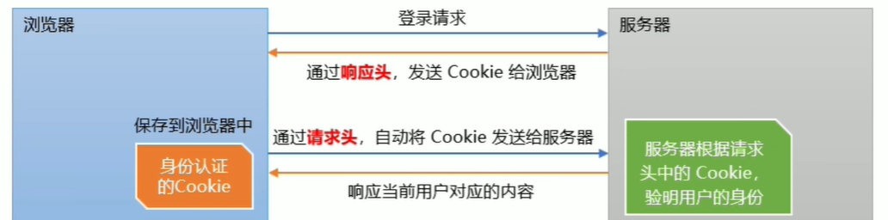
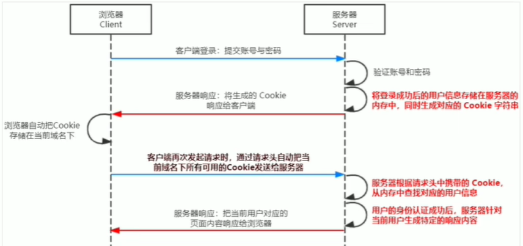
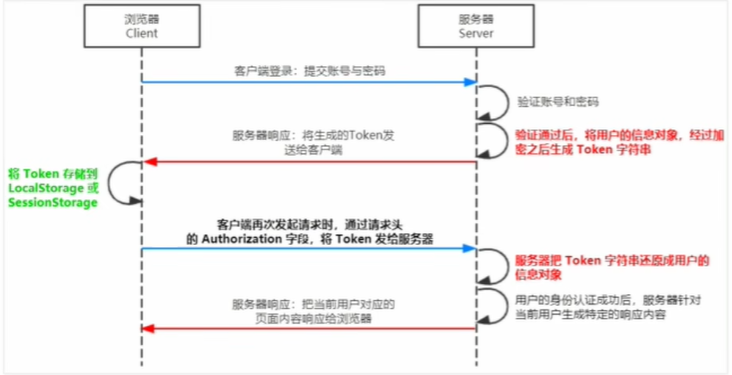

# 前后端交互

## web 开发模式

#### 基于服务端渲染的传统 web 开发模式

服务端渲染：服务器发送给客户端的 HTML 页面是在服务器通过字符串拼接动态生成的，因此客户端不需要使用 Ajax 这样的技术额外请求页面的数据

>   优点
>
>   前端耗时少
>
>   有利于SEO，因为服务器响应的是完整的 HTML 页面内容，所以利于爬虫爬取信息

>   缺点
>
>   占用服务器端资源，服务器端完成 HTML 页面内容的拼接，请求较多会对服务器造成一定压力
>
>   不利于前后端分离，开发效率低

#### 基于前后端分离的新型 web 开发模式

前后端分离的概念：前后端分离依赖于 Ajax 技术的广泛应用，后端只负责提供 API 接口，前端使用 Ajax 调用接口

>   优点
>
>   开发体验好，前端专注于 UI 页面的开发，后端专注于 api 的开发
>
>   用户体验好，Ajax 轻松实现页面的局部刷新
>
>   减轻了服务器端的渲染压力，页面最终是在每个用户的浏览器中生成的

>   缺点
>
>   不利于 SEO，完整的 HTML 页面需要在客户端动态拼接完成，所以爬虫无法爬取页面的有效信息
>
>   （解决方案：利用 Vue、React等前端框架的 SSR(server side render) 技术可以解决 SEO 问题）

#### 如何选择 web 开发模式

企业级网站：主要功能是展示而没有复杂的交互，并且需要良好的 SEO，选择服务器端渲染

后台管理：交互性较强，不需要考虑 SEO，选择前后端分离的开发模式

为了同时兼顾首页的渲染速度和前后端分离的开发效率，采用首屏服务器渲染 + 其他页面前后端分离的开发模式

## 身份认证

` 身份认证（Authentication）[身份验证、鉴权]：通过一定手段完成对用户身份的确认`

对于服务器渲染和前后端分离这两种开发模式分别有着不同的身份认证方案

### 服务端渲染推荐使用 Session 认证机制

#### HTTP 协议的无状态性

` 客户端每次的 HTTP 请求都是独立的，连续多个请求之间没有直接的关系，服务器不会主动保留每次 HTTP 请求的状态`

#### 突破 HTTP 无状态的限制 —— Cookie

` Cookie 是存储在用户浏览器中的一段不超过 4kb 的字符串，由一个键值对name、value和其他几个用于控制 Cookie 有效期、安全性、适用范围的可选属性组成`

不同域名下的 Cookie 各自独立，每当客户端发起请求时，会自动把当前域名下所有未过期的 Cookie 一同发送给服务器

>   Cookie 的特性：
>
>   自动发送
>
>   域名独立
>
>   过期时限
>
>   4kb 限制

#### Cookie 在身份认证中的作用

客户端第一次请求服务器的时候，服务器通过响应头的形式，向客户端发送一个身份认证的 Cookie，客户端会自动将 Cookie 保存在浏览器中

当客户端浏览器每次请求服务器的时候，浏览器会自动将身份认证相关的 Cookie，通过请求头的形式发送给服务器，服务器即可验明客户端的身份



#### Session 认证机制

##### Cookie 不具有安全性

` 由于 Cookie 是存储在浏览器中的，而且浏览器也提供了读写 Cookie 的 API，因此 Cookie 很容易被伪造，不具有安全性，因此不建议服务器将重要的隐私数据通过 Cookie 的形式发送给浏览器`

所以不要使用 Cookie 存储用户的身份信息、密码等重要的隐私数据

##### Session 的工作原理



### 使用 Session 认证

` 安装 express-session 中间件`

``` 
npm install express-session
```

` 配置 express-session 中间件`

``` js
const session = require('express-session')
// 配置 session
app.use(session({
    secret: 'keyboard cat', // secret属性可以为任意字符串
    resave: false, // 固定写法
    saveUninitialized: true // 固定写法
}))
```

#### 向 session 中存数据

` 配置成功后即可通过 req.session 来访问和使用 session 对象，从而存储用户的关键信息`

``` js
app.post('/api/login',(req, res)=>{
    if(req.body.username !== 'admin' || req.body.password !== '123456')
        return res.send({ status: 1, msg: '登陆失败'})
    // 判断登录信息正确即可将用户信息和登陆状态存储到 session 中
    req.session.user = req.body
    req.session.islogin = true
    res.send({ status: 0, meg: '登陆成功'})
})
```

#### 从 session 中取数据

` 从 req.session 对象上获取存储的数据`

``` js
// 其他接口获取数据
app.get('/api/username', (req, res)=>{
    // 判断用户是否登录
    if(!req.session.islogin){
        return res.send({ status: 1, msg: 'fail'})
    }
    res.sned({ status: 0, msg: 'success', username: req.session.user.username })
})
```

#### 清空session

` req,session.destroy() 清空服务器保存的 session 信息`

``` js
// 退出登录的接口
app.post('/api/logput', (req, res)=>{
    // 清空当前客户端对应的 session 信息
    req.session.destroy()
    res.send({ status: 0, msg: '退出登录成功' })
})
```

只会清空当前用户对应的 session，不会清空服务器中所有的 session

#### Session 的局限性

` 当前端请求后端接口不存在跨域问题的时候，才推荐使用 Session 身份认证机制`

Session 认证机制需要配合 Cookie 才能实现，由于 Cookie 默认不支持跨域访问，所以涉及到前端跨域请求后端接口的时候，需要做很多额外的配置才能实现跨域 Session 认证

### 前后端分离推荐使用 JWT 认证机制

` 当前端需要跨域请求后端接口的时候，推荐使用 JWT 认证机制`

JWT（JSON Web Token）目前最流行的跨域认证解决方案

#### JWT 工作原理

` 用户的信息通过 Token 字符串的形式，保存在客户端浏览器中，服务器通过还原 Token 字符串的形式来认证用户的身份`



#### JWT 的组成部分

` JWT 通常由三部分组成，分别是 Header(头部)，Payload(有效荷载)，Signature(签名)`

三者之间用英文 . 分割，格式如下

```
Header.Payload.Signature
```

`Payload` 部分是真正的用户信息，它是用户信息经过加密之后生成的字符串

`Header` 和 `Signature` 是安全性相关的部分，只是为了保证 `Token` 的安全

#### JWT 的使用方式

客户端收到服务器返回的 JWT 之后，通常会将它存储在 localStorage 或 sessionStoreage 中

客户端每次与服务器通信，都要带上 JWT 的字符串进行身份验证，推荐的做法是`把 JWT 放在 HTTP 请求头的 Authorization 字段中`

``` 
Authorization: Bearer <token>
```

#### 安装 JWT 相关的包

` jsonwebtoken 用于生成 JWT 字符串`

` express-jwt 用于将 JWT 字符串解析还原成 JSON 对象`

``` 
npm install jsonwebtoken express-jwt
```

#### 导入 JWT 相关的包

``` js
const jwt = require('jsonwebtoken')
const expressJWT = require('express-jwt')
```

### 使用 JWT 认证

#### 定义用于加密和解密的 secret 密钥

` 保证 JWT 字符串的安全性，防止 JWT 字符串在网络传输过程中被别人破解`

>   作用：
>
>   当生成 JWT 字符串的时候，需要使用 secret 密钥对用户的信息进行加密，最终得到加密好的 JWT 字符串
>
>   当把 JWT 字符串解析还原成 JSON 对象的时候，需要使用 secret 密钥进行解密

``` js
const secretKey = 'miyaodebenzhi:jiushiyigezifuchuan^-^'
```

` 密钥的本质就是一个字符串`

#### 在登陆成功后生成 JWT 字符串

` 调用 jsonwebtoken 提供的 sign() 将用户的信息加密成 JWT 字符串响应给客户端`

``` js
app.post('/api/login', (req, res)=>{
    // 省略登录验证和登录失败
    res.send({
        status: 200,
        message: '登陆成功',
        token: jwt.sign({username: 'dzw'}, secretKey, { expiresIn: '30s' })
    })
})
// expiresIn 配置项指定 token 有效期
```

` sign(用户信息对象, 加密密钥, 配置对象)`

#### 将 JWT 字符串还原为 JSON 对象

` 客户端在每次访问接口时，都需要主动通过请求头中的 Authorization 字段，将 Token 字符串发送到服务器进行身份验证`

#### 使用 express-jwt

` 服务器通过 express-jwt 自动将客户端发送的 Token 解析还原成 JSON 对象`

``` js
app.use(expressJWT({ secret: secretKey }).unless({ path: [/^\/api\//] }) )
```

>   app.use() 用于注册中间件
>
>   expressJWT({ secret: secretKey }) 用于解析 Token 的中间件
>
>   .unless({ path: [/^\/api\//] }) 用于指定哪些接口不需要访问权限，传入一个正则表达式(这里是以 api 开头的不需要访问权限)

### 使用 req.user 获取用户信息

` 当 express-jwt 中间件配置成功之后，即可在有权限的接口中使用 req.user 对象来访问从 JWT 字符串中解析出来的用户信息`

``` js
app.get('/admin/getinfo', (req, res)=>{
    console.log(req.user)
    // express-jwt 会把解析出来的用户信息挂载到 req.user 属性上
})
```

#### 捕获解析 JWT 失败后产生的错误

` 当使用 express-jwt 解析 Token 字符串时，如果客户端发送过来的 Token 字符串过期或不合法，会产生一个解析失败的错误，影响项目的正常运行，我们可以通过 Express 的错误中间件，捕获这个错误并进行相关处理`

注册全局错误中间件

``` js
app.use((err, req, res, next)=>{
    // token 解析失败导致的错误
    if(err.name === 'UnauthorizedError'){
        return res,send{ status: 401, message: '无效 token' }
    }
})
```

