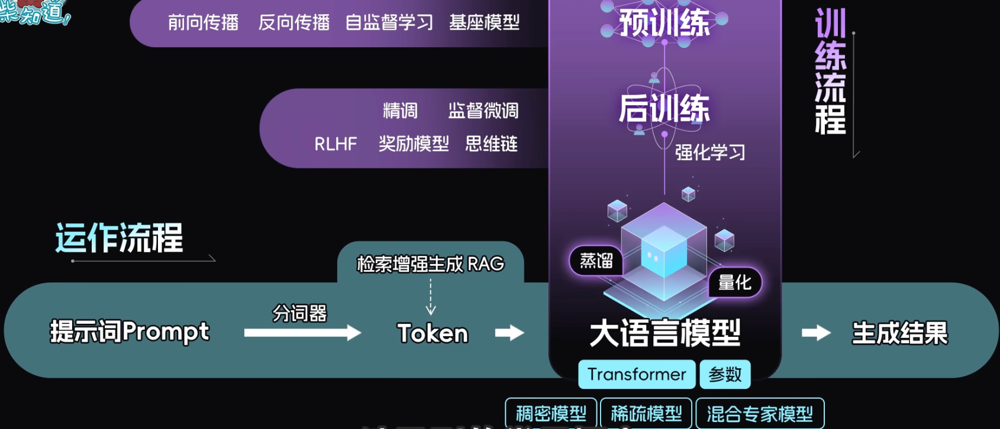
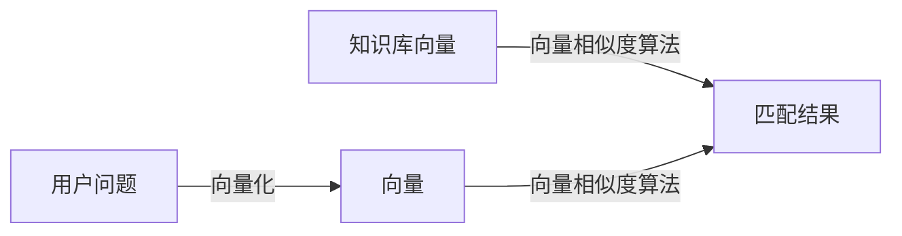

# Vue

## Vue2 vs Vue3
- Vue2使用Object.defineProperty递归代理，Vue3使用Proxy
- Options API → Composition API
- 更好的TypeScript支持
- ESM按需引入 & Tree Shaking
- diff算法从递归改为队列+静态标记

## ref 与 reactive 区别及实现原理

| 特性     | ref                                                          | reactive                                                     |
| -------- | ------------------------------------------------------------ | ------------------------------------------------------------ |
| 核心定位 | 用于包装**基本数据类型**（Number/String/Boolean 等），也可包装对象 / 数组 | 用于包装**引用数据类型**（Object/Array），无法直接包装基本类型 |
| 访问方式 | 需通过 `.value` 访问 / 修改值（模板中可省略）                | 直接访问 / 修改属性，无需 `.value`                           |
| 适用场景 | 单个基本类型数据（如 count、flag）、需独立响应式的对象       | 复杂对象 / 数组（如用户信息、列表数据），需深层响应式的场景  |

#### 🔍 ref 实现原理

1. **包装层设计**：创建一个 `RefImpl` 类实例，将基本类型值存入实例的 `_value` 属性；
2. **响应式劫持**：通过`Object.defineProperty`劫持实例的`value`属性（get/set）：
   - `get`：触发依赖收集（track），返回 `_value`；
   - `set`：更新 `_value`，触发依赖更新（trigger）；
3. **特殊处理**：若 ref 包装的是对象 / 数组，内部会调用 `reactive` 对其进行深层响应式转换；
4. **模板语法糖**：模板中访问 ref 时，Vue 自动解构 `.value`，无需手动书写。

#### 🔍 reactive 实现原理

1. **Proxy 代理**：基于 ES6 `Proxy` 对目标对象进行代理（而非 Object.defineProperty），支持监听对象属性的增删、数组的索引 / 长度变化
2. **深层响应式**：递归遍历目标对象的所有嵌套属性，对每个层级的对象都创建 Proxy 代理
3. 依赖追踪：
   - `get` 拦截：触发依赖收集（track），若访问的属性是对象，递归转为 reactive
   - `set`/`deleteProperty` 拦截：触发依赖更新（trigger）
4. **局限性**：无法代理基本类型（Proxy 仅支持对象），因此不能直接用于基本类型值

## scoped原理
- 为每个DOM元素添加[data-v-xxx]属性（相同组件不同DOM这个属性值相同）
- CSS选择器添加属性选择器后缀实现样式隔离

## diff算法
- 只比较同级，不跨级比较（时间复杂度是n，严格对比时间复杂度是n3）
- tag不同直接删除重建
- 子节点通过key区分
- Vue2：双端比较
- Vue3：最长递增子序列

## 循环中必须使用key的原因
- diff算法根据key判断元素是否需要删除
- 匹配到key只移动元素，性能较好
- 未匹配key则删除重建，性能较差

## 双向绑定原理

- 数据劫持（Object.defineProperty或Proxy）
- 发布订阅模式（实现子更新父数据）

## 组件通信

1. 父子组件通信

| 方式                    | 核心逻辑                                                     | 适用场景                                |
| ----------------------- | ------------------------------------------------------------ | --------------------------------------- |
| props/$emit             | 父传子：父组件通过 props 向子组件传值；子传父：子组件 $emit 触发事件，父组件监听接收 | 父子单向数据传递（最常用）              |
| ref/\(parent/\)children | 父用 ref 获取子组件实例，直接访问子组件方法 / 数据；子用 $parent 访问父组件实例 | 父子组件直接调用方法 / 取数（少量场景） |
| v-model                 | 语法糖，本质是 props（value）+ $emit（input），实现父子双向绑定 | 表单类组件双向数据同步                  |
| .sync 修饰符            | 语法糖，简化子向父传值（update:xxx 事件），实现 props 双向更新 | 非表单类 props 双向同步（Vue2）         |

2. 跨级 / 兄弟组件通信

| 方式              | 核心逻辑                                          | 适用场景                                              |
| ----------------- | ------------------------------------------------- | ----------------------------------------------------- |
| provide/inject    | 父组件 provide 提供数据，子孙组件 inject 注入使用 | 隔代组件通信（无需逐层透传 props）                    |
| EventBus 事件总线 | 创建全局 Vue 实例，通过\(on订阅/\)emit 发布事件   | 中小型项目的兄弟 / 跨级通信（Vue2）                   |
| Vuex/Pinia        | 全局状态管理库，统一维护共享数据，组件按需存取    | 大型项目多组件共享数据（Vue2 用 Vuex，Vue3 用 Pinia） |

3. 其他方式

| 方式                | 核心逻辑                                                     | 适用场景                                     |
| ------------------- | ------------------------------------------------------------ | -------------------------------------------- |
| \(attrs/\)listeners | \(attrs接收父组件透传的非props属性；\)listeners 接收父组件透传的事件 | 隔代组件透传属性 / 事件（Vue2）              |
| 插槽（Slot）        | 父组件通过插槽向子组件传递结构 / 组件，子组件渲染            | 父子组件传递 DOM 结构 / 组件（带数据）       |
| 全局变量 / 本地存储 | 挂载到 window / 使用 localStorage/sessionStorage 存数据      | 简单场景的跨组件数据共享（慎用，易维护性差） |

## watch vs watchEffect

**定义**

- **watch**：显式监听指定数据源，仅在数据源变化时执行，侧重 “针对性监听 + 获取新旧值”；
- **watchEffect**：隐式监听回调内用到的所有响应式数据，立即执行且数据变化时重新执行，侧重 “自动收集依赖 + 副作用执行”。

**差异**

| 维度     | watch                                | watchEffect                                       |
| -------- | ------------------------------------ | ------------------------------------------------- |
| 监听目标 | 手动指定（如 ref / 对象属性 / 数组） | 自动收集回调内的响应式依赖                        |
| 执行时机 | 初始不执行（需配置 immediate）       | 立即执行（首次加载就触发）                        |
| 取值方式 | 能获取新旧值（(newVal, oldVal)）     | 无新旧值，直接取当前值                            |
| 使用场景 | 需精准监听某 / 某些数据，关注值变化  | 需监听多个依赖，仅执行副作用（如请求 / 操作 DOM） |

**场景**

- **watch**：监听单个数据变化做精准处理（如监听输入框值变化触发搜索、监听路由参数变化）；
- **watchEffect**：多个依赖联动的副作用（如根据多个表单字段联动请求接口、监听数据变化更新 DOM）。

## 生命周期

#### 核心阶段与关键行为

Vue 组件的生命周期本质是**组件从创建到销毁的完整生命周期链路**，整体分为「初始化 / 挂载」「更新」「销毁」三大核心阶段，每个阶段对应明确的钩子函数，核心作用是让开发者在组件不同阶段插入自定义逻辑。

| 生命周期阶段 | Vue2 钩子函数                                | Vue3 组合式 API 钩子 | 关键行为（核心能力 + 限制）                                  |
| ------------ | -------------------------------------------- | -------------------- | ------------------------------------------------------------ |
| 初始化前期   | beforeCreate                                 | setup ()（执行阶段） | 组件实例刚创建，未初始化数据响应式、事件 / 方法；无法访问 `data`/`props`/`$el` |
| 初始化后期   | created                                      | setup ()（执行完毕） | 完成数据响应式、方法 / 事件初始化；可访问 `data`/`props`，但 DOM 未生成（`$el` 不存在）；适合执行异步请求（如接口调用） |
| 挂载前期     | beforeMount                                  | onBeforeMount        | 模板编译完成，虚拟 DOM 已生成，即将挂载到真实 DOM；仍无法操作真实 DOM |
| 挂载完成     | mounted                                      | onMounted            | 组件挂载到真实 DOM 完成；可操作 DOM（如获取 DOM 节点、初始化第三方插件）；是操作真实 DOM 的第一个时机 |
| 更新前期     | beforeUpdate                                 | onBeforeUpdate       | 数据已更新，虚拟 DOM 即将重新渲染；可在此时获取更新前的 DOM 状态 |
| 更新完成     | updated                                      | onUpdated            | 虚拟 DOM 重新渲染并更新到真实 DOM；可操作更新后的 DOM，但需避免在此修改数据（易触发无限更新循环） |
| 销毁前期     | beforeDestroy（Vue2）/ beforeUnmount（Vue3） | onBeforeUnmount      | 组件即将销毁，仍可访问组件实例、DOM、数据；适合清理资源（如定时器、事件监听、第三方插件实例） |
| 销毁完成     | destroyed（Vue2）/ unmounted（Vue3）         | onUnmounted          | 组件实例完全销毁，DOM 节点被移除，所有响应式依赖、事件监听全部清除；无法再访问组件数据 / DOM |

#### 父子组件生命周期执行顺序

**挂载阶段** 生命周期执行顺序为：

`父 beforeCreate` → `父 created` → `父 beforeMount` → `子 beforeCreate` → `子 created` → `子 beforeMount` → `子 mounted` → `父 mounted`

**更新阶段**（父 / 子数据变更触发更新）：

`父 beforeUpdate` → `子 beforeUpdate` → `子 updated` → `父 updated`

**销毁阶段**：

`父 beforeUnmount` → `子 beforeUnmount` → `子 unmounted` → `父 unmounted`

#### 父子生命周期执行顺序的底层逻辑

**共性底层原则：**

Vue 父子组件生命周期执行的核心设计原则是：**保证 DOM 结构 / 组件资源的完整性与数据流向的合理性**，即「子组件先完成当前阶段的核心操作，父组件再完成」，本质是因为父组件的 DOM / 资源依赖子组件的完整状态。

1. 挂载阶段：先子挂载，后父挂载

- 核心逻辑：父组件的真实 DOM 包含子组件的 DOM，只有子组件完成挂载（mounted），父组件的 DOM 树才是完整的；
- 细节补充：
  - 父组件先执行 beforeCreate/created，是为了完成自身数据初始化，才能将 props 传递给子组件（子组件依赖父组件的 props 数据）；
  - 父组件执行 beforeMount 后，开始解析模板中的子组件标签，触发子组件的初始化与挂载流程；
  - 父组件必须等待所有子组件 mounted 后，自身才执行 mounted，确保父组件操作 DOM 时能访问到完整的子组件 DOM。

2. 更新阶段：先子更新，后父更新

- 核心逻辑：父组件数据变更可能通过 props 传递给子组件，导致子组件重新渲染；只有子组件完成 DOM 更新（updated），父组件的 DOM 才是最终的完整状态；
- 细节补充：若子组件仅自身数据变更，父组件无更新逻辑，因此仅执行子组件的更新钩子；若父组件数据不影响子组件，也仅执行父组件自身的更新钩子。

3. 销毁阶段：先子销毁，后父销毁

- 核心逻辑：避免内存泄漏，先释放子组件的资源（定时器、事件监听、DOM 引用、第三方插件实例），再释放父组件资源；
- 细节补充：若先销毁父组件，子组件可能仍持有父组件的无效引用（如 props 数据、事件回调），导致资源无法被垃圾回收，引发内存泄漏；因此必须先执行子组件的 beforeUnmount/unmounted，清理子组件资源后，再执行父组件的销毁钩子。

#### 补充说明

1. 多子组件场景：若父组件有多个同级子组件，按模板中出现的顺序依次执行每个子组件的完整生命周期（子 1 挂载完成 → 子 2 开始初始化 → 子 2 挂载完成 → 父挂载）；
2. 异步操作影响：父组件 created/beforeMount 中的异步请求（如接口），回调执行时机可能晚于子组件 mounted，此时异步数据更新会触发父 / 子组件的更新钩子；
3. Vue3 组合式 API 兼容：setup () 执行时机等同于 Vue2 的 beforeCreate，执行完毕等同于 created；其余钩子（onBeforeMount/onMounted 等）执行顺序与 Vue2 完全一致。

# React

## 常用Hook

- useState、useEffect、useRef、useContext

## Hook

让函数组件能用上状态和生命周期

## Hook 否在循环中使用
- 不能在循环、条件判断或嵌套函数中调用
- Hook需要每次渲染都以相同的顺序执行，这样才能识别每个Hook对应的状态
- Hook调用顺序不一致，React没法正确追踪状态
- 官方明确规定Hook只能在组件的顶层作用域或者自定义Hook中调用

## Fiber架构
- 解决递归渲染DOM树的性能问题
- 将DOM树改为链表树
- 将渲染任务拆分成小单元，可中断
- 优先执行交互任务

## 渲染原理
- 虚拟DOM ➕ 调和（处理虚拟DOM）
- JSX → 虚拟DOM → 真实DOM
- 状态变化时生成新虚拟DOM，对比差异后同步到真实DOM

## useMemo 与 useCallback 

1. 核心作用：解决 “不必要的重计算 / 重创建” 问题

两者均用于 React 性能优化，针对函数组件重渲染时的**性能浪费**：

- 当组件因 props/state 变化重渲染时，内部定义的函数、计算结果会被重新创建 / 计算，即使结果不变，也可能触发子组件不必要的重渲染（尤其子组件使用`React.memo`浅比较时）
- 两者通过`缓存结果`，避免这种无意义的重复操作

2. 核心区别：缓存的对象不同

- **useMemo**：缓存**计算结果（值）**

  语法：`useMemo(() => 计算逻辑, [依赖数组])`

  示例：缓存复杂运算的结果（如列表排序、数据过滤），避免每次渲染重新计算

- **useCallback**：缓存**函数本身**

  语法：`useCallback(函数体, [依赖数组])`

  示例：缓存传给子组件的回调函数，避免每次渲染创建新函数实例，导致子组件误触发重渲染

3. 核心原理：依赖数组驱动的缓存机制

- 两者均通过**依赖数组**判断是否更新缓存：

  - 首次渲染时，执行逻辑并缓存结果（值 / 函数）。
  - 后续重渲染时，若依赖数组中的元素与上一次完全一致（浅比较），直接返回缓存结果；若有变化，则重新执行逻辑并更新缓存。
  
- 本质是 **“记忆化（Memoization）”** 技术：通过存储计算结果 / 函数引用，避免相同输入下的重复执行，减少性能开销。

### **4. 使用场景对比**

| 函数        | 适用场景                                                     | 典型案例                                   |
| ----------- | ------------------------------------------------------------ | ------------------------------------------ |
| useMemo     | 1. 复杂计算（耗时操作，如大数据处理）2. 防止因值变化导致的子组件重渲染 | 缓存排序后的列表、格式化后的大量数据       |
| useCallback | 1. 传递给子组件的回调函数（尤其子组件用`React.memo`包裹时）2. 作为其他 Hook 的依赖（如`useEffect`） | 缓存`onClick`回调、`useEffect`依赖中的函数 |

### **总结**

- 共性：均为性能优化工具，通过缓存减少重复计算 / 创建，依赖数组控制缓存更新
- 差异：useMemo 缓存 “值”，解决计算开销；useCallback 缓存 “函数”，解决引用变化导致的重渲染
- 注意：无需过度使用，仅在确有性能问题时引入（缓存本身也有微小开销）

# 前端框架

## Vue vs React

**相同点**

- 都是前端框架，用于快速搭建页面
- 都使用虚拟DOM
- 都支持组件化开发

**差异点**

- **数据响应式**：Vue通过代理监听响应式数据变化，React需要setState触发重新渲染
- **Diff算法**：Vue跟踪每个组件依赖精准更新；React从根节点递归比较

  > React：仅右移
  > Vue2：双端比较
  > Vue3：最长递增子序列，减少中间的对比次数
- **语法**：Vue使用模板语法，React使用JSX
- **数据流**：Vue是双向数据流，React是单向数据流
- **适用场景**：Vue适合快捷开发，React更灵活适合复杂项目

## Next.js

- 全栈框架：基于 React 的完整全栈开发框架
- 服务端渲染：支持 SSR，提升首屏加载速度和 SEO
- 静态站点生成：支持 SSG，构建时预渲染页面
- 混合渲染：可根据页面需求选择 SSR、SSG 或 CSR
- 文件系统路由：基于文件结构自动生成路由
- API 路由：内置 API 支持，无需额外配置服务器
- Server Component：Next.js在推，组件在服务器端渲染，直接将渲染好的html发送给浏览器，省去了大量JS代码打包，减少浏览器内存占用和计算负担，加快首屏加载速度

# 前端工程化

## 工程化解决了什么问题

当一个项目很大的时候，就可能会出现

- 全局污染（函数名、变量名冲突）
- 依赖混乱（JS文件间互相调用引起的依赖混乱）

## 工程化内容

- 模块规范
     CommonJS`同步，适合Node`、ESM（ES module）`异步，适合前端开发`
     规定代码怎么拆分成模块

- 工程化工具
     webpack、Vite
     解决模块打包、代码转译、热更新、开发服务器等一些列问题

- 前端框架
     Vue、React
     快速搭建用户界面，不用自己手写复杂的DOM操作

## 前端错误捕获

- try-catch 同步错误捕获
  用于捕获同步代码中的错误，无法捕获异步错误和语法错误

- window.onerror 全局错误捕获
  全局错误监听，可以捕获运行时错误，但无法捕获资源加载错误

- window.addEventListener error 资源加载错误

  专门捕获图片、脚本、样式表等资源加载失败的情况

- unhandledrejection Promise错误捕获
  捕获未被处理的Promise拒绝（rejection）错误

- Vue错误处理 app.config.errorHandler
  Vue提供的全局错误处理钩子，捕获组件渲染和观察期间未捕获的错误

- React错误边界
  React组件级的错误捕获机制，用于捕获子组件树中的JavaScript错误

- 网络请求错误捕获
  针对fetch、XMLHttpRequest等网络请求的错误处理

- 控制台错误重写
  重写console.error等方法，监控和控制台输出相关的错误

- 跨域脚本错误处理 window.onerror中message是 'Script error.'
  处理由于跨域策略导致的脚本错误信息受限问题

- 性能监控错误
  通过Performance API监控长时间任务等性能相关问题

## Vite vs Webpack

**Webpack**

- 打包所有模块再启动开发服务（冷启动较慢）
- 生态更完善，插件丰富
- 配置相对复杂

**Vite**

- ESM按需加载，不用打包，开发服务器启动快
- 基于Rollup打包，体积更小
- 更轻量，开发体验更好
- 热更新更快（文件指纹）

## Webpack 开发 / 生产打包方式差异

### 开发模式（development）

- **目标**：提升开发体验，强调快速构建、热更新、源码调试。
- **特性**：
  - 代码处理：不压缩、不混淆代码，保留 source-map，支持断点调试；
  - 构建策略：全量打包（即使只改一个文件，也重新打包整个依赖图），输出未优化的 bundle；
  - 额外能力：内置`webpack-dev-server`，基于内存打包（不生成物理文件），支持热模块替换（HMR）。

### 生产模式（production）

- **目标**：优化代码体积、提升运行性能，强调线上可用性。
- **特性**：
  - 代码处理：删除无用代码（Tree-Shaking）、压缩 CSS/JS、清除 console、生成优化后的 source-map；
  - 构建策略：全量打包并深度优化，输出多个拆分后的 chunk（如公共依赖、业务代码分离），生成物理文件；
  - 性能优化：启用缓存（`cache: true`）、多线程打包（`thread-loader`），降低打包时间但优先级低于产物优化。

## Vite 开发 / 生产打包方式差异

### 开发模式（development）

- **目标**：极致的冷启动 / 热更新速度，基于原生 ESM 无需打包。
- 关键特性：
  - 无打包构建：启动时不解析整个依赖树，仅启动一个原生 ESM 服务器，请求模块时按需编译（如.vue/.ts 文件）；
  - 依赖处理：预构建依赖（esbuild，Go 语言编写），将 CommonJS/UMD 格式的依赖转为 ESM，且缓存预构建结果；
  - 源码处理：通过浏览器原生 ESM 加载源码，每个文件作为独立模块请求，无需打包成 bundle；
  - 调试能力：保留源码结构，支持精准的 source-map，无需等待全量打包即可启动（毫秒级）。

### 生产模式（production）

- **核心目标**：兼容生产环境，输出优化后的 bundle（基于 Rollup）。
- 关键特性：
  - 打包工具：切换为 Rollup（而非 esbuild，因 Rollup 的 Tree-Shaking / 代码分割更成熟）；
  - 代码优化：深度 Tree-Shaking、CSS 提取压缩、chunk 分割、预加载指令（preload/prefetch）；
  - 兼容性处理：自动转换 ESM 为兼容浏览器的格式，处理 polyfill，生成静态资源；
  - 产物输出：生成物理文件，结构类似 Webpack 生产包，但体积更小、打包速度快于 Webpack（Rollup+esbuild 预编译）。

## Webpack 与 Vite 热更新机制差异

### Webpack 热更新（HMR）

1. **核心原理**：基于 “全量依赖图 + 补丁替换”；
2. 执行流程：
   - 启动时构建完整的模块依赖图并打包；
   - 文件修改后，Webpack 重新编译该模块及其依赖模块，生成更新后的 chunk；
   - 通过 WebSocket 通知浏览器，替换对应的模块（若模块无法热更新则刷新页面）；
3. **痛点**：项目越大，依赖图越复杂，热更新耗时越长（秒级甚至数十秒）。

### Vite 热更新（HMR）

1. **核心原理**：基于 “原生 ESM + 精准模块替换”；
2. **执行流程**：
   - 开发时模块通过原生 ESM 加载，每个文件对应唯一的 URL；
   - 文件修改后，Vite 仅重新编译该文件（esbuild 编译，毫秒级），无需处理依赖链；
   - 通过 WebSocket 通知浏览器，仅替换该模块的 ESM 请求（如`import.meta.hot`），不影响其他模块；
3. **优势**：热更新速度与项目体积无关，即使万行代码项目，热更新仍为毫秒级。

## Vite 与 Webpack 实现原理核心差异

| 维度     | Webpack                                                    | Vite                                                         |
| -------- | ---------------------------------------------------------- | ------------------------------------------------------------ |
| 核心思想 | 基于 “打包”：启动时构建完整依赖图，将所有模块打包成 bundle | 基于 “无打包”：开发时按需加载原生 ESM，生产时基于 Rollup 打包 |
| 模块处理 | 兼容 CommonJS/ESM，需将所有模块转为 webpack 内部模块格式   | 开发时仅处理 ESM，依赖通过 esbuild 预构建为 ESM              |
| 构建工具 | 内置打包器（JS 编写），可扩展但速度慢                      | 开发：esbuild（Go）；生产：Rollup（JS），兼顾速度与优化      |
| 启动逻辑 | 全量编译→打包→启动服务器，耗时随项目体积线性增加           | 预构建依赖→启动 ESM 服务器，启动速度基本不随项目体积变化     |
| 依赖解析 | 运行时解析依赖（打包时构建依赖图）                         | 编译时按需解析（浏览器请求时实时处理）                       |
| 性能核心 | 依赖缓存、多线程打包优化全量构建速度                       | 规避全量打包，利用原生 ESM 和 esbuild 极致提速               |

### 总结

- Webpack 是 “打包优先”：无论开发 / 生产都先打包，兼容性强、生态丰富，但大型项目启动 / 热更新慢；
- Vite 是 “按需编译 + 原生 ESM”：开发时抛弃打包，生产时复用 Rollup 的优化能力，速度远快于 Webpack，但生态稍弱（适配 Vite 的插件少于 Webpack）。

## CommonJS vs ES Module

**CommonJS**

- 运行时加载
- 导出的是值的拷贝
- 同步加载，适合Node.js

**ES Module**

- 编译时加载，支持静态分析（不运行代码就知道模块之间的依赖关系）
- 导出的是值的引用
- 异步加载，适合浏览器
- 支持Tree Shaking

## Hash模式 VS Histroy模式

**Hash模式**

- URL格式：`http://example.com/#/page`
- 原理：监听URL中#后面的哈希值变化
- 刷新影响：不会触发页面刷新
- 部署要求：无需服务器特殊配置
- SEO支持：较差，搜索引擎不识别#后内容

**History模式**

- URL格式：`http://example.com/page`
- 原理：使用HTML5 History API（pushState, replaceState）
- 刷新影响：会向服务器发送请求
- 兼容性：需要IE10+或现代浏览器
- 部署要求：需要服务器配置，所有路由指向index.html
- SEO支持：良好，URL更友好易被搜索引擎收录

## webview与h5的通讯

- PostMessage：支持跨域，双方都需要发送消息和监听
- URL Scheme拦截：H5跳转自定义URL，webview拦截并解析URL参数
- JSbridge：通过注入原生对象到H5的window上，H5调用该对象方法，原生监听并处理，再回调结果给H5
- WebSocket：建立长链接，WebView和H5通过消息推送实时通信
- 本地存储共享：通过LocalStorage、sessionStorage共享数据，各自写入各自读取
- Cookie共享：可以同步登陆状态

## 微前端

**目的**：

- 解决巨石应用（维护性、打包、管理、降低开发和维护成本）
- 解决遗留系统迁移

**原理**：主应用加载和管理子应用

vue和react都是将所有内容最终挂在在一个dom上，而微前端就是主应用统一管理挂载和卸载，并处理一下通讯和样式隔离

**优化**：

- 样式隔离：Shadow DOM
- 通信：消息订阅发布、EventBus（总之都是在创建子应用的时候传入了函数）
- 模块公用和依赖管理
- 子应用懒加载和预加载

**缺点**：

- 应用间通信复杂
- 全局状态管理和样式隔离需要额外处理
- 首次加载性能开销

## Monorepo

1. 定义

Monorepo（Monolithic Repository，单体仓库）是一种**代码管理策略**：将多个独立项目（或模块）的源代码统一存储在**一个仓库**中管理，而非每个项目单独建仓（多仓模式，Multi-repo）

核心特征：单仓库、多项目 / 模块共享基础设施（依赖、配置、工具），支持跨项目协作与代码复用

2. 作用

- **高效代码复用**：不同项目可直接引用仓库内的公共模块（如工具函数、组件库、通用配置），无需通过 npm 包发布 / 安装，修改公共代码后所有依赖项目即时生效

- **统一依赖与配置**：仓库级统一管理依赖包（如前端的 npm 依赖、构建工具配置），避免多仓中依赖版本不一致导致的 “环境不一致” 问题，减少 “在我这能跑” 的尴尬

- **简化跨项目协作**：跨项目修改（如 A 项目需调整 B 项目的接口适配）无需跨仓库提 PR、同步代码，直接在同一仓库内修改、测试，协作效率大幅提升

- **统一工程化规范**：仓库内共享构建、测试、CI/CD 流程，确保所有项目遵循相同的代码规范、测试标准，降低团队协作的沟通成本与维护成本

- **简化版本管理**：无需维护多个仓库的版本号同步，复杂项目（如前端 + 后端 + 共享库）可统一发布版本，追溯变更更清晰

3. 优缺点

| 优点                   | 缺点                                   |
| ---------------------- | -------------------------------------- |
| 跨项目复用成本低       | 仓库体积会随项目增多变大               |
| 依赖与规范统一         | 权限管理更精细（需控制项目访问权限）   |
| 协作效率高、变更追溯易 | 构建 / CI 需优化（避免全量构建）       |
| 减少 “重复造轮子”      | 对工具链（如构建、版本管理）有一定要求 |

4. 适用场景

- 多模块 / 多项目紧密协作的团队（如前端组件库 + 多个业务应用、前后端一体化项目）；

- 需频繁复用公共代码、统一规范的场景；

- 追求高效协作、降低跨项目沟通成本的团队。

## 前端整合方案

**iframe**

- 无法共享登录态
- 通信复杂
- 隔离性最好

**微前端**

- 适合大型项目多子应用
- 完善的生态和解决方案

**Web Components**

- 原生JS组件化方案
- 保持样式和逻辑一致性

## webcomponents

原生JS组件化

## iframe通信

- postmessage
- localStroage和sessionStorage
- 通过操作iframe页面的window对象进行通信（需要同源）

## iframe缺点

- 无法和主项目共享登录态
- 无法像一个项目一样通讯

## 分包

**概念**：将应用代码拆分成多个包，按需加载
**作用**：减少首屏加载时间，优化缓存策略，提高构建效率
**核心价值**：提升用户体验，控制包大小，实现渐进式加载
**分包原理**：

- 依赖分析：构建工具分析模块间依赖关系
- 代码分割：通过分割点将代码提取到独立chunk
- 动态加载：运行时按需加载分包代码
- 资源管理：独立缓存和版本控制

### 不同框架分包实现

**Webpack**
- 动态导入：`import()`语法自动分包
- 配置分割：splitChunks配置vendor包
- 魔法注释：webpackChunkName指定包名
- 预加载：webpackPrefetch预加载非关键包

**Vite**

- ESM原生：基于ES模块的按需加载
- Rollup配置：manualChunks手动分块
- 自动优化：依赖分析自动提取公共模块

**小程序**

- 配置驱动：app.json中配置subpackages
- 独立分包：independent字段标记独立运行
- 预加载规则：preloadRule配置预加载策略
- 大小限制：主包2M，总分包20M

### 独立分包

- 核心特点：不依赖主包独立运行
- 启动优势：直接加载分包，跳过主包
- 限制：无法共享主包样式和组件
- 适用场景：功能独立、需要快速启动的页面
- 进入不独立分包页面需加载主包

### 预加载机制

- 原理：预测用户行为，提前加载可能需要的资源
- 实现方式：
  - Webpack：魔法注释webpackPrefetch
  - 小程序：preloadRule配置预加载规则
  - 原生：link rel="preload"预加载关键资源
- 策略：基于用户行为分析，空闲时加载非关键资源

### 分包异步化

- 概念：先占位渲染，分包加载后替换实际内容
- 实现模式：
  - React：Suspense + React.lazy
  - Vue：异步组件配置
  - 小程序：require.async跨包引用
- 优势：提升感知性能，实现渐进式渲染
- 分包异步化有点类似于骨架屏，先占位渲染，之后在其他包加载之后再渲染为对应组件

### 包大小控制

- 限制标准：主包≤2M，总分包≤20M（小程序标准）
- 优化策略：
  - 公共依赖提取
  - 重复代码检测
  - 按需引入第三方库
  - 资源压缩和优化

### 跨包通信

- 限制：默认不能直接引用其他包组件
- 解决方案：
  - 异步加载：require.async或import()
  - 事件通信：全局事件总线
  - 状态共享：全局状态管理
- 设计原则：明确接口，降低耦合度

## 组件设计原则

- 复用性：通用组件抽象
- 可维护性：清晰的接口和文档
- 性能：避免不必要的渲染
- 兼容性：多端适配
- 易用性：简洁的API设计

## eval 动态注入代码

**核心**：运行时将字符串解析为可执行代码并执行，突破静态编码的固定逻辑限制

**解决的问题**：

- 静态代码扩展性不足：无需重启服务 / 重构代码，即可调整业务规则（如动态配置验证逻辑）

- 快速迭代需求：无需重新编译部署，快速更新执行逻辑（如线上临时功能补丁）

- 轻量化扩展：避免复杂插件架构，通过字符串配置实现功能适配

**优点**

- 灵活性高：适配多变的业务规则与配置需求
- 开发效率提升：减少重复编码与部署流程，快速验证临时逻辑
- 扩展成本低：无需引入复杂架构，字符串配置即可实现功能扩展

**缺点**

- 安全风险突出：外部输入未过滤易引发代码注入攻击（如恶意执行系统命令）
- 可维护性差：动态代码隐藏于字符串，无法 IDE 语法检查、调试困难
- 性能损耗：字符串解析 + 编译过程额外消耗资源，高频执行场景性能下降
- 兼容性问题：不同语言 / 环境下行为差异大，跨环境适配复杂

## 自动化测试

1. `纯 Node.js 环境的单元 / 逻辑测试`（代表：Jest）

**核心实现方式**：脱离浏览器环境，基于 Node.js 虚拟机运行测试代码，通过「模拟（Mock）+ 断言」验证代码逻辑

- 对 DOM/BOM 等浏览器 API 做模拟（如 jsdom），无需真实渲染页面
- 聚焦函数、组件逻辑的输入输出验证，而非页面交互
- 核心是 “隔离依赖 + 单模块验证”，通过多线程并行执行提升效率

2. `无头浏览器 + 自定义脚本`（代表：Puppeteer/Playwright + Node 脚本）

**核心实现方式**：基于真实浏览器内核（Chromium/Firefox 等）的无头模式，通过 Node 脚本直接操控浏览器行为

- 完全模拟真实用户操作（点击、输入、滚动、跳转）
- 可捕获真实页面的性能指标（加载时间、资源大小、LCP/FID 等）、DOM 渲染状态
- 核心是 “精准复刻用户行为 + 获取真实运行数据”，定制化极强（可自由编写任意操作逻辑）

3. `跨端 Web 驱动测试`（代表：Selenium）

**核心实现方式**：通过 WebDriver 协议（中间层）连接不同浏览器（Chrome/Firefox/Edge），实现跨浏览器 / 跨语言的页面操控

- 不直接操作浏览器，而是通过驱动程序下发指令，兼容不同浏览器内核
- 支持多语言（Java/Python/JS 等）编写测试脚本，核心解决 “跨浏览器兼容性测试” 问题
- 核心是 “协议层抽象 + 跨环境适配”，适合多端统一的 Web 自动化

4. `浏览器内嵌入式测试`（代表：Cypress）

**核心实现方式**：测试脚本与被测应用运行在同一浏览器上下文（而非跨进程），直接操控浏览器原生 API

- 无需 WebDriver 中间层，实时感知页面异步操作（自动等待元素加载、请求完成）；
- 内置浏览器环境，支持实时调试、录屏，核心是 “无跨进程损耗 + 强异步适配”，专注单浏览器（Chrome）的前端交互测试。

5. `AI 大语言模型驱动测试`（代表：MCP Server + LLM）

**核心实现方式**：以自然语言为输入，通过 MCP（模型上下文协议）让 LLM 对接测试工具（浏览器 / 脚本），自动生成 / 执行测试逻辑

- 核心是 “自然语言转测试指令”，无需手动编写脚本
- LLM 可感知页面状态变化，动态调整测试步骤（如发现元素不存在时自动重试 / 换路径）
- 本质是 “AI 替代人工编写脚本 + 动态适配测试流程”，降低代码编写门槛

6. `模型驱动测试`（MDT）

**核心实现方式**：先构建系统 / 业务的抽象模型（如 UML、状态机、业务流程图），再基于模型自动生成测试用例和执行逻辑

- 从 “业务逻辑 / 系统规则” 出发，而非手动编写单个用例
- 自动覆盖模型中的分支、状态转换场景，核心是 “用模型覆盖场景 + 自动化生成用例”，适合复杂业务系统

7. `数据驱动测试`（DDT）

**核心实现方式**：将测试数据与测试逻辑完全分离，测试脚本仅保留通用操作流程，数据从外部文件（JSON/CSV/ 数据库）读取

- 同一套操作逻辑，可批量执行不同输入数据的测试（如登录场景：多组账号密码）；
- 核心是 “数据复用 + 逻辑统一维护”，减少重复脚本编写，适合高频回归的场景

## 灰度测试

#### 1. 基于用户属性的静态灰度（最基础）

- **实现逻辑**：通过用户固定属性（用户 ID、设备型号、地域、会员等级等），在前端代码中写死判断规则，符合规则的用户加载新版本资源，否则加载旧版本

- 优点：

  - 实现简单，无需依赖后端或第三方服务，纯前端即可完成
  - 规则明确，同一用户始终命中同一版本，便于问题追溯
  - 开发成本低，适合小型项目或初期灰度验证
  
- 缺点：

  - 灵活性差，调整灰度人群需修改代码并重新发布
  - 规则固化，无法动态扩大 / 缩小灰度范围
  - 可能因属性分布不均导致测试偏差（如某地域用户特征特殊）

#### 2. 基于后端接口的动态灰度

- **实现逻辑**：前端请求后端接口时，后端返回用户的灰度标识（如`isGray: true`），前端根据标识加载对应版本资源（如不同 JS/CSS 文件、组件）。

- 优点：

  - 灰度规则由后端动态控制，无需前端发版即可调整人群
  - 支持按比例、属性等复杂规则（规则逻辑在后端实现）
  - 可结合用户画像精准圈选测试人群
  
- 缺点：

  - 依赖后端接口，前后端需协同开发
  - 首次加载可能因接口请求延迟导致版本切换卡顿
  - 若后端接口异常，可能影响整体灰度逻辑

#### 3. 基于 Feature Flag（功能开关）的灰度

- **实现逻辑**：在前端代码中嵌入开关变量（如`featureFlags.newLogin: true/false`），通过配置中心（如 LaunchDarkly、阿里云配置中心）动态控制开关状态，决定是否渲染新功能

- 优点：

  - 粒度极细，可控制单个按钮、组件或页面的灰度
  - 无需发版即可开启 / 关闭功能，回滚成本极低
  - 支持多场景组合（如 “新用户 + 特定地域” 开启功能）
  - 可与 A/B 测试结合，对比不同功能效果
  
- 缺点：

  - 需接入配置中心，增加前端依赖和开发成本
  - 开关过多时易导致代码冗余（需定期清理过期开关）
  - 配置中心的可用性直接影响功能稳定性

#### 4. 基于资源版本的灰度（CDN / 静态资源）

- **实现逻辑**：将新旧版本的静态资源（JS、CSS、图片）部署到不同 CDN 路径（如`v1.0.0/main.js`、`v2.0.0/main.js`），前端通过动态计算或后端返回的版本号，加载对应路径的资源

- 优点：

  - 完全隔离新旧版本资源，避免代码冲突
  - 支持快速回滚（切换回旧版本资源路径即可）
  - 适合大版本更新或重构场景
  
- 缺点：

  - 资源冗余，需同时维护多版本静态文件
  - 若资源依赖复杂（如公共库版本差异），可能导致加载异常
  - 首次加载新版本资源时，可能因缓存问题导致体验不一致

#### 5. 基于路由的灰度

- **实现逻辑**：在前端路由层（如 React Router、Vue Router）添加灰度判断，符合条件的用户路由到新版本页面（如`/new-home`），其他用户路由到旧版本页面（如`/home`）

- 优点：

  - 页面级隔离，新旧版本页面逻辑互不干扰
  - 可针对特定页面灰度，不影响整体应用
  - 实现简单，仅需在路由配置中添加判断规则
  
- 缺点：

  - 仅适用于页面级灰度，无法控制组件级细节
  - 若页面间有数据交互，可能因版本差异导致数据不兼容
  - 路由规则调整需前端发版（静态路由场景）

#### 6. 基于 A/B 测试工具的灰度（第三方工具）

- **实现逻辑**：接入第三方 A/B 测试工具（如 Optimizely、Google Optimize），通过工具配置灰度人群和版本规则，工具在前端动态替换 DOM、CSS 或 JS 逻辑

- 优点：

  - 无需开发介入，产品 / 运营可直接配置灰度规则
  - 自带数据统计功能，可对比不同版本的转化、留存等指标
  - 支持可视化编辑（如拖拽修改页面元素）
  
- 缺点：

  - 依赖第三方工具，可能存在性能损耗（额外脚本加载）
  - 高级功能需付费，成本较高
  - 复杂逻辑修改受限，更适合 UI / 交互层面的灰度

#### 核心对比总结

- **优先选 Feature Flag**：需精准控制、频繁调整功能，或需快速回滚的场景；
- **优先选后端动态灰度**：灰度规则复杂（如按比例、用户标签），且前后端协同能力强的场景；
- **优先选资源版本灰度**：大版本更新、重构，或需完全隔离新旧逻辑的场景；
- **避免过度设计**：小型项目或简单灰度需求，用用户属性静态灰度即可，降低成本。

## 版本管理核心原则

#### 1. 可灰度：分阶段控制发布范围

- **核心逻辑**：不直接全量发布新版本，而是通过 “分层、分群、分比例” 的方式逐步放量，让部分用户先体验新版本，验证无问题后再扩大范围。
- **核心价值**：将风险限制在小范围，避免全量发布时的大规模故障。

#### 2. 可监控：实时感知版本状态

- **核心逻辑**：新版本发布后，通过多维度监控指标，实时检测功能可用性、性能表现、用户行为异常，及时发现灰度 / 全量过程中的问题。
- 前端重点监控指标：
  - 技术指标：页面加载时间（LCP/FID/CLS）、JS 错误率、接口请求成功率、资源加载失败率；
  - 业务指标：核心功能点击率、转化率、用户留存率、异常反馈量；
  - 监控工具：Sentry（错误监控）、Datadog/New Relic（性能监控）、百度统计 / GA（用户行为）、自定义埋点告警。
- **核心价值**：快速定位问题（如新版本导致的 JS 报错、性能下滑），避免问题扩散。

#### 3. 可回滚：故障时快速兜底

- **核心逻辑**：提前预设回滚方案，当监控发现新版本存在严重问题（如功能不可用、报错率突增）时，能在短时间内将系统恢复到稳定的旧版本。
- 前端回滚方式：
  - 静态资源回滚：切换 CDN 资源路径至旧版本（如从`v2.0.0/main.js`切回`v1.9.0/main.js`）；
  - 功能开关回滚：直接关闭 Feature Flag，禁用新版本功能；
  - 路由回滚：将灰度路由（如`/new-home`）重定向至旧版本路由（如`/home`）；
  - 部署回滚：重新发布旧版本构建包（适用于打包部署场景）。
- **核心价值**：降低故障影响时长，减少用户损失，是版本发布的 “安全兜底”。

## 程序设计模式

#### 一、创建型模式（聚焦 “对象创建”，简化创建逻辑）

**1. 单例模式**

- **核心**：保证一个类仅创建一个实例，全局可访问。
- **例**：Vuex 的 store 实例、Vue 的全局 EventBus、浏览器的`window`对象，均为单例；项目中封装的全局请求实例（如 axios）也常用单例模式，避免重复创建请求对象。

**2. 工厂模式**

- **核心**：通过 “工厂方法” 封装对象创建逻辑，根据入参返回不同类型对象，无需暴露创建细节。
- **例**：Vue 组件库中，根据传入的`type`参数（如`primary`/`success`）生成不同样式的按钮组件；封装请求函数时，根据`method`（GET/POST）返回不同的请求实例。

#### 二、结构型模式（聚焦 “对象组合”，优化代码结构）

**1. 代理模式**

- **核心**：为目标对象提供代理，控制对目标对象的访问（如拦截、增强操作）。
- **例**：Vue 2 的响应式原理（Object.defineProperty）本质是代理模式，代理数据的读取 / 修改，触发依赖收集和更新；图片懒加载（代理图片加载，先加载占位图，滚动到可视区再加载真实图片）。

**2. 装饰器模式**

- **核心**：不修改原对象，通过 “装饰” 动态扩展对象功能。
- **例**：Vue 中的装饰器语法（如`@Component`/`@Prop`），扩展组件的属性和行为；给按钮添加防抖 / 节流装饰器，不修改按钮点击逻辑，仅增强点击行为。

**3. 适配器模式**

- **核心**：转换接口，让不兼容的接口能协同工作。
- **例**：封装不同端的 API（如 H5 和小程序的分享接口），提供统一的`share`方法适配差异；axios 拦截器中转换后端返回的异常格式，适配前端统一的错误处理逻辑。

#### 三、行为型模式（聚焦 “对象交互”，优化协作逻辑）

**1. 观察者模式（发布 - 订阅模式）**

- **核心**：观察者订阅事件，被观察者（发布者）触发事件时通知所有观察者，解耦发布者和观察者。
- **前端举例**：Vue 的响应式更新（数据为发布者，视图为观察者，数据变化触发视图更新）；EventBus（`$on`订阅 /`$emit`发布）；浏览器的 DOM 事件（如`addEventListener`订阅点击事件）。

**2. 策略模式**

- **核心**：定义多个算法 / 策略，封装后可按需切换，避免大量`if-else`。
- **前端举例**：表单验证（根据不同字段类型，切换手机号 / 邮箱 / 密码的验证策略）；根据环境（开发 / 测试 / 生产）切换不同的接口域名策略。

**3. 迭代器模式**

- **核心**：提供统一方式遍历不同结构的数据（如数组、对象、Set），无需关心数据内部结构。
- **前端举例**：ES6 的`for...of`遍历器（可遍历数组、Map、Set 等）；Vue 的`v-for`指令，统一遍历数组 / 对象，屏蔽数据结构差异。

## 架构设计模式

| 模式     | 介绍                                                         | 代表框架 / 场景                        |
| -------- | ------------------------------------------------------------ | -------------------------------------- |
| **MVX**  | Model（数据）+ View（视图）+ X（中间层）的**总称**，是分层解耦架构的统称，X 是变量，包含 MVC/MVP/MVVM 等变种 | 所有分层架构的客户端 / 前端项目        |
| **MVC**  | Model + View + Controller（控制器）View 触发事件→Controller 处理→操作 Model→手动更新 ViewView 与 Model 可直接通信 | jQuery、Backbone.js、早期 Android 开发 |
| **MVP**  | Model + View + Presenter（中间人）View 与 Model 完全隔离，全靠 Presenter 中转处理、更新 View | 中大型 Android 应用、WinForm 开发      |
| **MVVM** | Model + View + ViewModel（数据桥梁）View 与 ViewModel **双向绑定**，数据变化自动同步，无需手动更新 | Vue、Angular、React（近似）、SwiftUI   |

**对比**

| 对比维度          | MVC                  | MVP                   | MVVM（前端主流）      |
| ----------------- | -------------------- | --------------------- | --------------------- |
| 本质定位          | 基础分层模式         | MVC 的解耦升级版      | 前端主流双向绑定模式  |
| 中间层角色        | Controller（调度者） | Presenter（手动中转） | ViewModel（自动绑定） |
| View-Model 耦合度 | 弱耦合（可直接通信） | 完全解耦              | 完全解耦              |
| 数据同步方式      | 手动更新 View        | 手动调用 View 方法    | 自动双向绑定          |
| 前端适配性        | 低（需操作 DOM）     | 中（需写更新逻辑）    | 高（框架封装）        |
| 可测试性          | 一般                 | 高                    | 高                    |

**总结**

- MVX：分层解耦架构的 “大家族总称”；
- MVC：控制器管所有，视图数据能直接聊；
- MVP：中间人做中转，视图数据不说话；
- MVVM：双向绑定省力气，数据视图自动更。

# JavaScript

## proxy 缺点

- 兼容性：不支持IE浏览器
- 性能：处理大量数据或频繁操作对象会比Object.defineProperty稍差
- 调试：不容易看出是哪里触发了拦截

## Arguments对象

- 包含函数调用时的所有实参
- 有length属性，但不能用数组方法

## ES6 内容

1. let/const 声明
   - 块级作用域变量 / 常量，解决 var 变量提升和作用域污染问题，const 声明只读常量（引用类型内部可修改）。
2. 箭头函数
   - 简洁函数写法 `() => {}`，无独立 this（继承外层作用域 this），不能作为构造函数，适合简短回调。
3. 解构赋值
   - 快速从数组 / 对象中提取值并赋值给变量，如 `let [a,b] = [1,2]`、`let {name} = {name: 'test'}`，简化数据读取。
4. 模板字符串
   - 反引号 ``` 包裹，支持换行和变量插值 `${变量}`，替代传统字符串拼接，如 ``姓名：${name}``。
5. 对象字面量增强
   - 支持属性简写（`{name}` 等价于 `{name:name}`）、方法简写（`{fn(){}}`）、计算属性名（`{[key]: value}`），简化对象定义。
6. Class 类
   - 提供面向对象编程的语法糖，基于原型链实现，支持 `class` 定义类、`constructor` 构造器、`extends` 继承，让面向对象代码更清晰。
7. 模块化（ES Module）
   - 引入 `import/export` 实现模块隔离，支持按需导入导出，替代 CommonJS/AMD 等方案，成为前端模块化标准。
8. Promise
   - 异步编程解决方案，解决回调地狱问题，通过 `new Promise((resolve,reject)=>{})` 封装异步操作，支持 `then/catch/finally` 链式调用。
9. Set/Map 数据结构
   - **Set**：存储唯一值的集合，实现数组去重；**Map**：键值对集合，键支持任意类型（突破对象键仅为字符串 / 符号的限制）。
10. WeakSet/WeakMap
    - 弱引用版本的 Set/Map，键 / 值仅支持对象，不阻止垃圾回收，适合存储临时关联数据，避免内存泄漏。
11. Symbol 数据类型
    - 新增基本数据类型，生成唯一标识，用于定义对象私有属性或避免属性名冲突，如 `const key = Symbol()`。
12. Generator 函数
    - 用 `function*` 定义，通过 `yield` 实现函数执行的暂停 / 恢复，支持数据双向传递，是 async/await 的底层基础。
13. 扩展运算符 / 剩余参数
    - **扩展运算符** `...`：展开数组 / 对象，如 `Math.max(...arr)`、`{...obj}`；**剩余参数**：收集函数多余参数为数组，如 `fn(...args)`。
14. 默认参数
    - 函数参数支持设置默认值，如 `function fn(a=10){}`，简化参数默认逻辑。
15. for...of 循环
    - 遍历可迭代对象（数组、Set、Map 等），支持中断循环，比 for...in 更适合遍历值。

## 原型和原型链

- 每个对象都有一个原型，原型也是对象
- 原型链是链式结构，终点是null
- JavaScript实现继承的核心机制

## 事件代理

- 利用事件冒泡机制
- 子元素事件统一绑定到父元素
- 动态添加元素无需重新绑定
- 减少内存占用

## entries

#### 定义

`entries()` 是 JavaScript 中**可迭代对象（如 Array、Map、Set）** 的内置方法，用于返回一个**迭代器对象**，该迭代器会按顺序生成包含可迭代对象中「键值对」的数组（格式：`[键, 值]`）。

- 调用后不会修改原对象，仅返回迭代器。
- 需配合 `for...of`、`next()` 等迭代方式使用。

#### 不同对象中 `entries()` 的作用与差异

1. 数组（Array）的 `entries()`

- **返回值**：迭代器，每次迭代生成 `[索引, 元素值]` 数组（索引为数字，从 0 开始）

  ```javascript
  const arr = ['a', 'b', 'c'];
  const iterator = arr.entries();
  for (const entry of iterator) {
    console.log(entry); // [0, 'a'] → [1, 'b'] → [2, 'c']
  }
  ```

- **作用**：同时获取数组的索引和对应元素，适合需要索引参与的遍历场景（如修改特定位置元素、统计元素位置）

2. Map 的 `entries()`

- **返回值**：迭代器，每次迭代生成 `[键, 值]` 数组（Map 中「键」可以是任意类型）

  ```javascript
  const map = new Map();
  map.set('name', 'Alice');
  map.set('age', 20);
  for (const entry of map.entries()) {
    console.log(entry); // ['name', 'Alice'] → ['age', 20]
  }
  ```

- **作用**：遍历 Map 中的所有键值对，是 Map 默认的迭代方式（直接 `for...of map` 等效于 `map.entries()`）

3. Set 的 `entries()`

- **返回值**：迭代器，每次迭代生成 `[值, 值]` 数组（Set 中无键，键和值相同）

  ```javascript
  const set = new Set(['x', 'y']);
  for (const entry of set.entries()) {
    console.log(entry); // ['x', 'x'] → ['y', 'y']
  }
  ```

- **作用**：保持与其他可迭代对象 API 一致性，实际用途较少（通常直接用 `values()` 遍历 Set 值）

#### 应用场景

1. **数组遍历需索引时**：替代 `for` 循环，更简洁地同时获取索引和元素，例如：

   ```javascript
   // 过滤并记录符合条件元素的索引
   const arr = [10, 25, 8, 30];
   const result = [];
   for (const [index, value] of arr.entries()) {
     if (value > 20) {
       result.push({ index, value }); // 记录索引和值
     }
   }
   ```
   
2. **Map 键值对批量处理**：例如将 Map 转换为对象（适合键为字符串的场景）：

   ```javascript
const map = new Map([['id', 1], ['name', 'Bob']]);
   const obj = {};
for (const [key, value] of map.entries()) {
     obj[key] = value; // { id: 1, name: 'Bob' }
}
   ```

3. **实现可迭代对象的统一遍历逻辑**：当需要兼容数组、Map 等多种可迭代对象时，用 `entries()` 可统一处理「键值对」格式，例如通用的日志打印工具：

   ```javascript
   function logEntries(iterable) {
     for (const [key, value] of iterable.entries()) {
       console.log(`键: ${key}, 值: ${value}`);
     }
   }
   // 同时支持数组、Map
   logEntries(['a', 'b']);
   logEntries(new Map([['x', 1]]));
   ```
   

#### 总结

- **本质**：提供统一的「键值对迭代」接口，让不同可迭代对象的遍历逻辑一致。
- **关键差异**：不同对象的 `entries()` 返回的「键」含义不同（数组是索引，Map 是自定义键，Set 是值本身）。
- **使用原则**：需要同时处理「键 / 索引」和「值」时使用，单纯遍历值优先用 `values()`，单纯遍历键优先用 `keys()`。

## Set集合（无序、唯一值的集合）

- **`add(value)`**

  作用：向 Set 中添加元素（值唯一，重复添加无效）

  返回值：Set 本身（可链式调用）

  ```javascript
  const set = new Set();
  set.add(1).add(2); // 结果：Set {1, 2}
  ```

- **`delete(value)`**

  作用：删除指定元素

  返回值：删除成功返回 `true`，否则 `false`

  ```javascript
  set.delete(1); // true，Set 变为 {2}
  ```

- **`has(value)`**

  作用：判断元素是否存在于 Set 中

  返回值：`true`（存在）或 `false`（不存在）

  ```javascript
  set.has(2); // true
  ```

- **`clear()`**

  作用：清空 Set 中所有元素

  ```javascript
  set.clear(); // Set 变为空
  ```

- **`size`（属性，非方法）**

  作用：获取 Set 中元素的数量

  ```javascript
  new Set([1, 2, 3]).size; // 3
  ```

- **`forEach(callback[, thisArg])`**

  作用：遍历 Set 中所有元素（回调参数：`value, value, set`，因 Set 无键，键值相同）

  ```javascript
  new Set([1, 2]).forEach((val) => console.log(val)); // 1 → 2
  ```

- **`keys()` / `values()` / `entries()`**

  作用：返回迭代器（Set 中 `keys()` 与 `values()` 效果一致，`entries()` 返回 `[value, value]`）。

  ```javascript
  const iter = new Set([1, 2]).entries();
  iter.next(); // { value: [1, 1], done: false }
  ```

## Map 映射（键值对集合，键可任意类型）

- **`set(key, value)`**

  作用：向 Map 中添加键值对（键唯一，重复设置会覆盖旧值）

  返回值：Map 本身（可链式调用）

  ```javascript
  const map = new Map();
  map.set('name', 'Alice').set('age', 20); // Map { 'name' => 'Alice', 'age' => 20 }
  ```

- **`get(key)`**

  作用：获取指定键对应的值

  返回值：键存在则返回对应值，否则 `undefined`

  ```javascript
  map.get('name'); // 'Alice'
  ```

- **`delete(key)`**

  作用：删除指定键的键值对

  返回值：删除成功返回 `true`，否则 `false`

  ```javascript
  map.delete('age'); // true，Map 变为 { 'name' => 'Alice' }
  ```

- **`has(key)`**

  作用：判断键是否存在于 Map 中

  返回值：`true`（存在）或 `false`（不存在）

  ```javascript
  map.has('name'); // true
  ```

- **`clear()`**

  作用：清空 Map 中所有键值对

  无返回值

  ```javascript
  map.clear(); // Map 变为空
  ```

- **`size`（属性，非方法）**

  作用：获取 Map 中键值对的数量

  ```javascript
  new Map([['a', 1], ['b', 2]]).size; // 2
  ```

- **`forEach(callback[, thisArg])`**

  作用：遍历 Map 中所有键值对（回调参数：`value, key, map`）

  ```javascript
  new Map([['a', 1]]).forEach((val, key) => console.log(key, val)); // 'a' 1
  ```

- **`keys()` / `values()` / `entries()`**

  作用：返回迭代器（`keys()` 遍历键，`values()` 遍历值，`entries()` 遍历 `[key, value]`）。

  ```javascript
  const iter = new Map([['a', 1]]).entries();
  iter.next(); // { value: ['a', 1], done: false }
  ```

## Map 与 WeakMap

#### 1. 核心差异

| 特性         | Map                                              | WeakMap                                                      |
| ------------ | ------------------------------------------------ | ------------------------------------------------------------ |
| **键的类型** | 任意类型（字符串、数字、对象、函数等）           | 仅支持**对象类型**（null 除外）                              |
| **引用特性** | 对键对象是**强引用**                             | 对键对象是**弱引用**                                         |
| **可遍历性** | 可遍历（forEach、for...of、keys/values/entries） | 不可遍历（无遍历方法、无 size 属性）                         |
| **垃圾回收** | 键对象即使无其他引用，Map 仍持有，不会被回收     | 键对象无其他强引用时，会被垃圾回收，对应键值对自动从 WeakMap 移除 |
| **额外方法** | 支持 clear () 清空所有键值对                     | 无 clear () 方法（ES2021 也未添加）                          |

#### 2. 核心作用

- **Map**：适用于需要**持久存储键值对**、**遍历键值对**、**键类型多样**的场景（如缓存固定数据、存储自定义键的映射关系）。
- **WeakMap**：适用于**临时关联对象数据**的场景（如 DOM 元素的附加数据、类的私有属性、避免内存泄漏的缓存），因为弱引用特性不会阻止键对象被垃圾回收。

## Set 与 WeakSet

#### 1. 核心差异

| 特性         | Set                                          | WeakSet                                                 |
| ------------ | -------------------------------------------- | ------------------------------------------------------- |
| **值的类型** | 任意类型（字符串、数字、对象、函数等）       | 仅支持**对象类型**（null 除外）                         |
| **引用特性** | 对值对象是**强引用**                         | 对值对象是**弱引用**                                    |
| **可遍历性** | 可遍历（forEach、for...of、keys/values）     | 不可遍历（无遍历方法、无 size 属性）                    |
| **垃圾回收** | 值对象即使无其他引用，Set 仍持有，不会被回收 | 值对象无其他强引用时，会被垃圾回收，自动从 WeakSet 移除 |
| **额外方法** | 支持 clear () 清空所有值                     | 无 clear () 方法                                        |

#### 2. 核心作用

- **Set**：适用于需要**去重**、**遍历唯一值集合**、**值类型多样**的场景（如数组去重、存储唯一的原始值 / 对象）。
- **WeakSet**：适用于**存储临时对象集合**的场景（如跟踪 DOM 元素、标记临时对象是否存在），弱引用特性避免内存泄漏。

## Map、WeakMap、Set、WeakSet清除后，内部对象是否被清除？

需分「主动清除」和「垃圾回收触发」两种场景分析：

#### 1. 主动调用 clear ()（仅 Map/Set 支持）

- **Map/Set**：调用 `clear()` 后，会移除内部所有键值对 / 值，对内部对象的**强引用被解除**。此时若这些对象无其他强引用，会被垃圾回收；若有其他强引用（如外部变量指向），则对象不会被清除。
- **WeakMap/WeakSet**：无 `clear()` 方法，无法主动清空；若想移除某个对象，只能等待该对象无其他强引用，由垃圾回收自动清理。

#### 2. 仅移除容器引用（如 `map = null`）

- **Map/Set**：若仅将 Map/Set 变量置为 null，但内部对象仍有其他强引用 → 对象不会被清除；若内部对象无其他强引用 → 因 Map/Set 原本的强引用被解除，对象会被垃圾回收。
- **WeakMap/WeakSet**：即使容器本身未被销毁，只要内部对象无其他强引用 → 对象会被垃圾回收，且容器中对应的键值对 / 值会自动消失。

#### 总结

- 「对象是否被清除」的核心是：**对象是否存在除容器外的其他强引用**，而非容器本身是否被清空。
- Map/Set 因强引用，若不主动清除容器或对象引用，对象不会被回收；WeakMap/WeakSet 因弱引用，无需手动清理，只要对象无其他引用就会被回收。

## 强引用与弱引用

1. **强引用**

   这是 JavaScript 中默认的引用类型，当一个变量（或数据结构）持有对象的强引用时，垃圾回收机制会认为该对象 “仍在使用”，不会回收其占用的内存。

   只要强引用存在，即使程序中不再实际使用这个对象，它也会一直驻留在内存中，可能引发内存泄漏。

   例如普通变量赋值`let obj = {name: 'test'}`，以及`Map`、`Set`对内部对象的引用，都属于强引用。

2. **弱引用**

   弱引用不会阻止垃圾回收机制回收目标对象，当一个对象仅被弱引用持有时，垃圾回收机制会在合适时机自动回收该对象，并释放其内存。

   JavaScript 中仅`WeakMap`（对键的引用）、`WeakSet`（对值的引用）实现了弱引用，且仅支持对象类型的弱引用，不支持原始值。

   例如将对象作为`WeakMap`的键时，若该对象无其他强引用，会被垃圾回收，同时对应的键值对也会从`WeakMap`中自动移除。

**对比**

| 特性               | 强引用                               | 弱引用                                      |
| ------------------ | ------------------------------------ | ------------------------------------------- |
| **默认行为**       | JavaScript 默认引用方式              | 仅`WeakMap/WeakSet`支持，非默认             |
| **垃圾回收影响**   | 阻止对象被垃圾回收                   | 不阻止对象被垃圾回收                        |
| **支持的数据类型** | 可引用任意类型（原始值、对象）       | 仅支持引用对象类型（null 除外）             |
| **可遍历性**       | 持有强引用的结构（如 Map/Set）可遍历 | 持有弱引用的结构（WeakMap/WeakSet）不可遍历 |
| **内存泄漏风险**   | 若未手动解除引用，易引发内存泄漏     | 无内存泄漏风险，自动随对象回收              |
| **典型使用场景**   | 需长期持有数据、遍历数据的场景       | 临时关联对象数据、避免内存泄漏的场景        |

## ？？与 ||

### ||（逻辑或运算符）

核心逻辑：若左侧操作数**为假值**（false、0、''、null、undefined、NaN），则返回右侧操作数；否则返回左侧操作数。

本质是 “判断是否为假值”，而非 “是否为 null/undefined”。

### ??（空值合并运算符）

ES2020 新增特性，核心逻辑：仅当左侧操作数**为 null 或 undefined** 时，返回右侧操作数；否则返回左侧操作数。

本质是 “判断是否为空值（null/undefined）”，对 0、''、false 等假值不敏感。

**示例**

```javascript
// 1. 左侧为 0（假值但非空值）
console.log(0 || 10); // 10（|| 认为 0 是假值，返回右侧）
console.log(0 ?? 10); // 0（?? 仅判断 null/undefined，返回左侧）

// 2. 左侧为空字符串
console.log('' || '默认值'); // '默认值'（|| 认为 '' 是假值）
console.log('' ?? '默认值'); // ''（?? 保留空字符串）

// 3. 左侧为 null
console.log(null || '默认值'); // '默认值'
console.log(null ?? '默认值'); // '默认值'（两者结果一致）

// 4. 左侧为 undefined
console.log(undefined || '默认值'); // '默认值'
console.log(undefined ?? '默认值'); // '默认值'（两者结果一致）
```

## Generator

Generator 是 ES6 引入的特殊函数（`function*` 定义），核心作用是**中断 / 恢复函数执行**，实现「可控的异步流程」和「惰性迭代」，是异步编程（如 async/await 底层）、自定义迭代器的基础。

1. **执行暂停与恢复**：通过 `yield` 关键字暂停函数执行，返回迭代器对象；调用 `next()` 可恢复执行，继续到下一个 `yield`/ 函数结束，支持分步执行逻辑。
2. **数据双向传递**：`next(参数)` 可将数据传入暂停处，`yield` 可向外返回值，实现函数内外数据交互。
3. **生成迭代器**：Generator 函数返回的迭代器可直接用于 `for...of` 遍历，轻松实现自定义迭代逻辑（如惰性生成无限序列、分页数据）。

**场景**

- 异步流程控制（async/await 基于 Generator + 自动执行器实现）；
- 惰性生成数据（按需产生值，避免一次性生成大量数据）；
- 自定义可遍历对象（替代手动写迭代器）。

**示例**

```javascript
function* gen() {
  yield 1; // 暂停，返回 1
  yield 2; // 恢复后暂停，返回 2
  return 3;
}
const g = gen();
g.next(); // { value: 1, done: false }
g.next(); // { value: 2, done: false }
g.next(); // { value: 3, done: true }
```

## flatMap 函数

**本质**

`flatMap` = `map`（映射） + `flat(1)`（一维扁平化）：先对数组每个元素执行映射操作，再将映射结果自动拍平一层，返回新数组。

**核心拆解**

1. 先看 map + flat 的组合（等价替代）

如果不用 `flatMap`，要实现相同效果需要两步：

```javascript
const arr = [1, 2, 3];

// 第一步：map 映射（每个元素变成数组）
const mapped = arr.map(num => [num, num * 2]); 
console.log(mapped); // [[1,2], [2,4], [3,6]]

// 第二步：flat(1) 拍平一层
const flattened = mapped.flat(1); 
console.log(flattened); // [1,2,2,4,3,6]

// flatMap 一步到位
const result = arr.flatMap(num => [num, num * 2]);
console.log(result); // [1,2,2,4,3,6]
```

# TypeScript

## 接口作用

- 定义数据结构的规范
- 规定必填、可选、只读属性
- 提供类型检查和智能提示
- 便于协作和代码维护

## interface vs type

**本质**

- **interface**：只给「对象 / 类」定 “结构规矩”（比如有哪些属性、方法），能多人接力改、能继承；
- **type**：给任意类型（字符串、数字、对象、复杂组合类型）起 “外号”，相当于自定义新类型，不能接力改，只能用 `&` 拼新类型。
  （可以简单理解为String、Number，这都是自带的type，而你可以创建自己的type）

**对比**

| 对比维度 | interface             | type                                             |
| -------- | --------------------- | ------------------------------------------------ |
| 声明合并 | 支持（同名自动合并）  | 不支持（重复定义报错）                           |
| 类型范围 | 仅能描述对象 / 类结构 | 支持所有类型（基本 / 联合 / 元组等）             |
| 扩展方式 | 用 extends 继承       | 用 & 交叉类型实现                                |
| 类实现   | 支持 class implements | 仅支持对象结构型 type，复杂 type（如联合）不支持 |

**适用场景**

- **interface**：定义 API 入参 / 返回值结构、类的属性方法约束、需要多人扩展的全局类型（如扩展 window 对象）；
- **type**：定义基本类型别名（如 type ID = string）、状态枚举（type Status = 'success'|'fail'）、元组 / 交叉类型组合。

## never 类型

**定义**

`never` 是 TypeScript 中表示 “永不存在的值的类型”，即某个场景下**不可能有任何值出现**，是所有类型的子类型，但没有任何类型是 `never` 的子类型（除自身）。

**特征**

1. **无值可达**：变量 / 返回值标注为 `never`，意味着该变量永远不会被赋值，该函数永远不会正常返回（要么抛错，要么无限循环）；
2. **类型收窄**：可用于穷尽性检查（确保条件分支覆盖所有可能）；
3. **兼容性**：`never` 可赋值给任意类型，但任意类型（除 `never`）都不能赋值给 `never`。

**使用场景**

1. 永远不会返回的函数

```ts
// 抛错函数：永远不会正常返回，返回值为never
function throwError(msg: string): never {
  throw new Error(msg);
}

// 无限循环函数：永远不会结束，返回值为never
function infiniteLoop(): never {
  while (true) {}
}
```

2. 穷尽性检查（确保分支全覆盖）

```ts
type Status = 'success' | 'fail' | 'pending';

function handleStatus(status: Status) {
  switch (status) {
    case 'success': break;
    case 'fail': break;
    case 'pending': break;
    // 若漏写分支，ts会报错：类型“string”不能赋值给类型“never”
    default: const _exhaustiveCheck: never = status;
  }
}
```

3. 类型收窄到无可能

```ts
// 当类型守卫排除所有可能后，剩余类型为never
function fn(x: string | number) {
  if (typeof x === 'string') {
    // x: string
  } else if (typeof x === 'number') {
    // x: number
  } else {
    // x: never（无其他可能）
  }
}
```

**与void区别**

| 类型  | 核心区别                           |
| ----- | ---------------------------------- |
| never | 永不存在值，函数永不返回           |
| void  | 函数无显式返回（可返回 undefined） |

# CSS

## Less & SCSS 

1. `Less`

   动态样式语言，基于 CSS 扩展，语法更贴近原生 CSS，学习成本低，通过客户端脚本或编译工具转换为标准 CSS。

2. `SCSS`

   Sass 的升级版语法，完全兼容 CSS3，支持嵌套、变量等高级特性，需编译为 CSS 运行，是目前更主流的 CSS 预处理器。

| 特性              | Less                              | SCSS                                              |
| ----------------- | --------------------------------- | ------------------------------------------------- |
| **语法风格**      | 兼容 CSS，无强制分号 / 大括号     | 兼容 CSS，可使用 Sass 缩进语法（无分号 / 大括号） |
| **变量声明**      | `@变量名: 值`                     | `$变量名: 值`                                     |
| **作用域**        | 先全局后局部，变量提升            | 局部优先，无变量提升                              |
| **混入（Mixin）** | `.mixin() { }`，直接调用 `.mixin` | `@mixin mixin() { }`，通过 `@include mixin` 调用  |
| **继承**          | 无原生继承，需用混入模拟          | `@extend 选择器` 实现样式继承                     |
| **循环**          | 仅支持 `each` 遍历                | 支持 `for`/`each`/`while` 多种循环                |
| **函数**          | 内置函数较少，扩展弱              | 内置丰富函数，支持自定义函数                      |
| **依赖管理**      | 需手动引入                        | 支持 `@use`/`@forward` 模块化导入                 |

**总结**

- Less：**轻量易上手**，适合小型项目或快速开发，对 CSS 新手友好。
- SCSS：**功能强大、生态完善**，支持复杂逻辑和模块化，适合中大型项目，社区资源更丰富。

# Node.js

## process.nextTick

**定义**

`process.nextTick` 是 Node.js 提供的专属 API，用于将**回调函数添加到 “nextTick 队列”**，该队列会在当前执行栈清空后、下一轮事件循环（Event Loop）开始前立即执行，属于 “微任务” 范畴且优先级高于 Promise.then 等其他微任务。

**特点**

1. **执行时机**：当前同步代码执行完毕 → 执行 nextTick 队列所有回调 → 再处理其他微任务（如 Promise）→ 进入事件循环的下一个阶段（如 timers、I/O 回调等）。
2. **高优先级**：nextTick 队列的执行优先级是 Node.js 事件循环中最高的，即使多次调用 `process.nextTick`，也会一次性执行完队列中所有回调，再继续后续流程。
3. **无异步延迟**：不同于 `setTimeout(fn, 0)`（会推迟到下一轮事件循环的 timers 阶段），`process.nextTick` 无最小延迟，执行更即时。
4. **注意点**：若递归调用 `process.nextTick`，会阻塞事件循环（因为一直执行 nextTick 队列，无法进入后续阶段），导致 I/O 回调、定时器等无法执行。

**示例**

```javascript
console.log('同步代码开始');
process.nextTick(() => {
  console.log('nextTick 回调执行'); // 同步栈清空后立即执行
});
Promise.resolve().then(() => {
  console.log('Promise.then 执行'); // 晚于 nextTick
});
console.log('同步代码结束');

// 输出顺序：
// 同步代码开始
// 同步代码结束
// nextTick 回调执行
// Promise.then 执行
```

## Node.js Classic 集群模式

**定义**

Node.js Classic 集群模式（`cluster` 模块实现）是 Node.js 官方提供的**多进程并发方案**，核心目的是突破单线程 EventLoop 的 CPU 利用率瓶颈 —— 通过启动多个子进程（Worker）共享同一个主端口（如 8080），利用多核 CPU 并行处理请求，提升服务吞吐量。

**核心架构（主从模式）**

1. 主进程（Master）

- 角色：进程管理器，不处理业务逻辑；
- 核心操作：
  1. 监听端口，接收所有客户端请求；
  2. 通过 `round-robin`（轮询）算法将请求分发到空闲的子进程；
  3. 管理子进程生命周期（创建、监控、重启崩溃的子进程）；
  4. 控制子进程通信（通过 `IPC` 通道传递消息）。

2. 子进程（Worker）

- 角色：业务处理单元，每个 Worker 是独立的 Node.js 进程，拥有自己的 EventLoop；
- 核心特性：
  1. 共享主进程监听的端口，无需单独绑定端口；
  2. 进程间内存隔离（每个 Worker 有独立的内存空间，不会共享变量）；
  3. 单个 Worker 崩溃不影响其他 Worker，主进程可自动重启。

**运行机制**

1. 启动流程：
   - 主进程加载 `cluster` 模块，调用 `cluster.fork()` 创建与 CPU 核心数匹配的 Worker 进程；
   - 所有 Worker 继承主进程的端口监听，操作系统将请求分发到不同 Worker。
2. 请求分发：
   - 底层依赖操作系统的 `SO_REUSEADDR` 套接字选项，实现多进程监听同一端口；
   - 默认用轮询策略分发请求，确保负载均衡。
3. 进程通信：
   - 主 / 子进程通过 `IPC`（Inter-Process Communication）通道通信，支持发送 / 接收 JSON 格式数据；
   - 无法直接共享内存，需通过主进程中转（或借助 Redis 等外部存储）。

**特点**

1. 优势

- 充分利用多核 CPU，解决 Node.js 单线程 CPU 密集型任务瓶颈；
- 进程隔离，单个 Worker 崩溃不导致整个服务宕机；
- 官方原生模块，无需额外依赖，配置简单。

2. 局限性

- 内存开销大（每个 Worker 独立占用内存，如单进程占用 50MB，8 核则约 400MB）；
- 进程间通信成本高，不适合高频数据共享；
- 仅解决 CPU 瓶颈，I/O 密集型场景优势不明显（Node.js 单线程已适配 I/O 异步）。

**典型使用场景**

- CPU 密集型服务（如数据计算、加密解密）；
- 高并发 HTTP 服务（如 API 网关、后台服务）；
- 需保障服务高可用的生产环境（进程崩溃自动重启）。

# 浏览器

## 浏览器存储

**Cookie**

- 容量：不超过4KB
- 生命周期：可设置过期时间，不设置则浏览器关闭清除
- 作用域：同源页面，可设置domain共享子域
- 自动发送：每次HTTP请求自动携带（可设置）

**LocalStorage**

- 容量：5MB
- 生命周期：永久存储，需手动清除
- 作用域：同源页面共享

**SessionStorage**

- 容量：5MB
- 生命周期：当前会话有效，标签页关闭即清除
- 作用域：同一标签页的同源页面共享

## 同源策略

- 是一种安全机制，用于限制不同源的资源访问
- 要求协议、域名、端口完全一致

## cookie 共享规则

- cookie的作用范围主要由domain和path决定
- 同源：页面之间共享cookie
- 跨域：默认不共享cookie
- 子域名：需要设置domain才能共享cookie

## localStroage 存大数据空间可能不够

- 通过测试数据分片存储，大致计算剩余空间

- 做回溯删除测试数据

## IndexedDB

IndexedDB 是浏览器内置的**非关系型（NoSQL）本地数据库**，基于事务机制，支持存储大量结构化数据（JSON、二进制数据等），弥补 localStorage 存储容量小（通常 5MB）、仅存字符串的不足

#### 作用：

1. 离线数据存储（如 PWA 应用离线缓存核心数据）
2. 大量前端数据持久化（如分页列表、用户操作记录）
3. 替代 localStorage 存储复杂结构数据（支持对象、数组、Blob 等）
4. 支持索引查询，提升大数据量下的检索效率

#### 特性

- 异步操作：所有 API 均为异步，避免阻塞主线程
- 跨域限制：仅同源页面可访问
- 存储容量：无固定上限（通常为几十 GB，受浏览器 / 设备限制）
- 事务机制：操作需在事务中执行，保证数据一致性
- 支持索引：可对字段创建索引，快速查询数据

#### 总结

1. IndexedDB 是浏览器端高性能、大容量的本地存储方案，主打异步、结构化数据存储
2. 核心流程：打开数据库 → 创建 / 获取对象仓库 → 开启事务 → 执行增删改查
3. 适用场景：离线应用、大数据量本地缓存、复杂结构数据存储
4. 注意：API 偏底层，实际开发可封装（如 localForage 库）简化使用

## 事件循环

**定义**

事件循环（Event Loop）是浏览器解决 JS 单线程异步执行的核心机制：JS 主线程执行同步代码，异步任务（宏 / 微任务）进入对应队列，同步代码执行完后，先清空所有微任务队列，再执行一个宏任务，重复此过程形成 “循环”。

**宏任务（Macrotask）**

| 类型                           | 常见场景                                        |
| ------------------------------ | ----------------------------------------------- |
| `script` 整体代码              | 页面加载时的主代码块                            |
| `setTimeout`/`setInterval`     | 定时器异步任务                                  |
| `setImmediate`（IE/Edge 支持） | 立即执行的宏任务                                |
| `I/O`                          | 网络请求、文件读写（浏览器端主要为 Ajax/fetch） |
| `UI Rendering`                 | 浏览器页面渲染（每轮事件循环末尾执行）          |
| `requestAnimationFrame`        | 动画帧回调                                      |

**微任务（Microtask）**

| 类型                         | 常见场景                                      |
| ---------------------------- | --------------------------------------------- |
| `Promise.then/catch/finally` | Promise 状态变更后的回调                      |
| `async/await`                | 本质是 Promise 语法糖，await 后代码属于微任务 |
| `MutationObserver`           | 监听 DOM 变化的回调                           |
| `queueMicrotask()`           | 手动添加微任务的 API                          |

**顺序**

1. 执行同步代码 → 遇到宏 / 微任务分别入对应队列；
2. 同步代码执行完毕 → 执行**所有微任务**（按入队顺序）；
3. 微任务清空后 → 执行**一个宏任务**；
4. 重复 1-3 步骤，形成事件循环。

**总结**

1. 微任务优先级高于宏任务，每轮宏任务执行后必清空微任务队列；
2. 常见微任务以 Promise 相关为主，宏任务以定时器、I/O 为主；
3. 事件循环保证了异步任务按序执行，避免单线程阻塞。

## V8 与 Web Worker

| 角色       | 核心作用                                                     |
| ---------- | ------------------------------------------------------------ |
| V8         | 运行 JS 代码的引擎，默认单线程工作；负责处理页面交互、DOM 操作、渲染相关逻辑，是前端代码的 “主执行者”。 |
| Web Worker | V8 的 “计算助手”，可新开独立线程；专门承接耗时长、占资源的计算类任务（如复杂数据运算、大量循环处理），不碰页面 DOM / 渲染。 |

**关系**

1. Web Worker 依附 V8 引擎存在，是为弥补 V8 单线程易卡顿的问题而生
2. 两者通过 “消息传递” 沟通（Worker 算完结果传给 V8），不共享数据，互不干扰
3. V8 专注页面核心交互 / 渲染，Worker 专注耗时计算，分工协作让网页更流畅

**总结**

V8 是管前端代码运行的 “主力”，Web Worker 是帮 V8 干脏活累活的 “计算助手”，避免主力被复杂计算卡住，导致页面卡顿。

## Runtime 模式 与 Web Worker 

#### Runtime 模式（主线程运行模式）

Runtime（运行时）模式，简单说就是**JS 代码默认在浏览器主线程（V8 引擎主线程）里执行**的模式：

- 主线程既要处理用户点击、页面渲染，又要跑所有 JS 代码；
- 如果代码里有耗时计算（比如大循环、复杂数据处理），会直接卡住主线程 → 页面卡顿、点不动（这就是你说的 “wrong time” 核心问题：把耗活放在了主线程的 “错误时机 / 错误位置”）。

#### Web Worker：解决 Runtime 模式卡顿的方案

Web Worker 是手动创建的 “独立子线程”（可以开多个），专门承接主线程的耗时计算，核心特点：

- ✅ 需**主动创建 + 调用**：不会自动生效，要手动写代码创建实例、发送任务；
- ✅ 不碰 DOM：子线程里不能操作页面元素（比如改按钮文字、渲染列表）；
- ✅ 消息通信：和主线程靠`postMessage()`传数据、`onmessage`收结果，互不干扰。
- ⚠️适配情况：1.CPU密集型；2.任务可被独立拆分；就可以通过Web Worker开多任务

eg：大文件上传（文件分片）、图表计算

#### 对比（Runtime → Web Worker 改造逻辑）

| 模式         | 执行位置   | 问题点                      | 改造为 Worker 后              |
| ------------ | ---------- | --------------------------- | ----------------------------- |
| Runtime 模式 | 主线程     | 耗时计算卡住页面渲染 / 交互 | 耗时计算移到 Worker 子线程    |
| Web Worker   | 独立子线程 | 不能操作 DOM、需手动调用    | 主线程专注渲染 / 交互，不卡顿 |

Runtime 是 JS 默认的主线程运行模式，容易因耗时计算卡顿；Web Worker 需要手动创建，把 “卡主线程的活” 移到独立子线程，让页面保持流畅，核心是 “主动拆分、消息通信”。

## V8 引擎工作过程

#### 定位

V8 是 Google 开发的开源 JavaScript 引擎，用于 Chrome 浏览器和 Node.js，**核心目标是高效编译、执行 JS 代码**，采用**即时编译（JIT）** 结合解释执行的混合模式。

#### 工作流程

1. **词法分析（Scanner）**
   - 把输入的 JS 源代码字符串，拆分成一个个**词法单元**（Token）
   - 例：`let a = 1;` → 拆分为 `let`/`a`/`=`/`1`/`;` 等 Token
2. **语法分析（Parser）→ 生成 AST**
   - 按照 JS 语法规则，将 Token 序列组装成**抽象语法树（AST）**，AST 是代码的树形抽象表示，丢弃了空格、注释等无关信息，只保留语法结构
   - **作用**：AST 是后续编译、优化的基础，ESLint、Babel、代码压缩工具都依赖 AST 工作
3. **解释执行（Ignition 解释器）**
   - V8 早期版本会直接用 **Ignition 解释器** 遍历 AST，生成**字节码**（介于 AST 和机器码之间的中间代码），然后逐行解释执行字节码
   - **优势**：启动快，适合首次执行的代码；**劣势**：执行速度比机器码慢
4. **编译优化（TurboFan 编译器）**
   - V8 的**热点代码监测**机制会统计代码执行次数，将频繁执行的代码标记为**热点代码**
   - TurboFan 编译器会把热点代码的字节码，编译成**优化后的机器码**，直接交给 CPU 执行，大幅提升执行速度
   - **关键优化**：基于类型推测（比如推测变量是数字类型）生成高效机器码；若类型发生变化（比如变量从数字变成字符串），会触发**去优化**，回退到解释执行
5. **垃圾回收（GC）**
   - 执行过程中，V8 的垃圾回收器会自动清理不再使用的内存（如未被引用的对象），通过**分代回收**（新生代 + 老生代）提升回收效率。

**总结**

V8 先把 JS 代码拆成 Token → 生成 AST → 解释器转字节码执行 → 热点代码由编译器转机器码提速，全程兼顾启动速度和运行性能。

## AST（Abstract Syntax Tree）

**AST（抽象语法树）**：源代码解析后的**结构化树状数据**，剥离格式细节（空格、注释），仅保留语法逻辑，是代码转换、分析的中间载体。

`AST定位:`**AST 是 JS 代码转换过程的中间数据结构**，能辅助浏览器的 JavaScript 引擎解析、检查语法并进行优化，最终高效执行 JS 代码。

#### 应用

1. **Babel 语法转换**

   - 解析 ES6+ 代码生成 AST
   - 遍历修改 AST（如箭头函数转普通函数）
   - 生成 ES5 兼容代码

2. **Vue 模板编译**

   Vue 在构建时，模板等内容先被解析成 AST，然后依据 AST 生成可在浏览器运行的 JavaScript 代码

3. **构建工具（Webpack/Vite）**

   - 分析 AST 梳理模块依赖
   - Tree-Shaking：删除 AST 中未使用的代码节点
   - 合并多模块 AST 生成打包产物

4. **代码压缩混淆（Terser）**

   - 遍历 AST 删注释、简化语法
   - 修改 AST 标识符（变量 / 函数名变短）
   - 生成体积更小、难阅读的代码

5. **代码检查（ESLint）**

   - 解析代码为 AST
   - 按规则检查 AST 节点（如禁用 `var`）
   - 输出语法 / 规范错误

**总结**

AST 是代码 “解析 - 修改 - 生成” 的核心，前端工具链几乎都依赖它。

## history部署

哈希模式（#）依赖浏览器端路由，history 模式依赖服务端配置，`部署核心是让服务端对所有路由请求返回前端入口文件（如 index.html）`

#### 步骤

1. 前端配置修改：
   - 路由配置中把`mode: 'hash'`改为`mode: 'history'`；
   - 若用 Vue/React 框架，配置`base`（如部署子路径需指定，例`base: '/admin/'`）。
2. 服务端配置（关键）：
   - Nginx：修改配置文件，添加`try_files $uri $uri/ /index.html;`（匹配不到文件时返回入口文件）；
   - Apache：配置`.htaccess`，添加`FallbackResource /index.html`；
   - Node.js（Express）：用`express-history-api-fallback`中间件，指向入口文件。

核心逻辑：history 模式下浏览器直接请求`/xxx`（无 #），服务端需拦截这类非静态资源请求，统一返回入口文件，由前端路由接管解析。

# 性能优化

## 核心指标
- 加载性能
- 资源加载大小
- 运行性能
- 内存性能

## 前端性能指标（谷歌提出）

| 简写     |           全写           | 释义             | 指标含义                                                 | 关注重点                            | 优化方案                                                     |
| -------- | :----------------------: | ---------------- | -------------------------------------------------------- | ----------------------------------- | ------------------------------------------------------------ |
| **Load** |        Load Event        | 页面加载完成事件 | 页面所有资源（DOM、CSS、JS、图片、字体等）加载完成后触发 | 全部资源加载完成情况                | 1. 压缩图片（WebP/AVIF 格式）、懒加载非首屏图片；2. 合并压缩 CSS/JS，剔除无用代码；3. 字体文件预加载（link rel="preload"）或使用系统字体；4. 减少第三方资源（如广告、统计脚本） |
| **FP**   |       First Paint        | 首次绘制         | 浏览器首次渲染像素的时间（如背景色）                     | 首次视觉反馈                        | 1. 内联关键 CSS（避免外部 CSS 阻塞渲染）；2. 减少首屏 HTML 体积（剔除冗余标签）；3. 避免首屏加载重量级 JS（延迟加载非关键 JS）；4. 设置页面背景色（让用户快速感知加载） |
| **FCP**  |  First Contentful Paint  | 首次内容绘制     | 首次渲染有意义内容（文本、图片等）的时间                 | 有用内容首次出现                    | 1. 优先加载首屏关键资源（文本、核心图片）；2. 内联首屏必要 JS（避免外部 JS 阻塞 DOM 解析）；3. 优化 HTML 解析（减少嵌套、避免同步脚本阻塞）；4. 使用 CDN 加速静态资源 |
| **DCL**  |     DOMContentLoaded     | DOM 内容加载完成 | 初始 HTML 解析完成（无需等 CSS / 图片）时触发            | DOM 解析效率                        | 1. 把非关键 JS 放在body底部或加defer/async；2. 减少 HTML 文件大小（压缩、剔除注释）；3. 避免同步加载第三方脚本；4. 优化 CSS 加载（避免 CSSOM 阻塞 DOM 解析） |
| **LCP**  | Largest Contentful Paint | 最大内容绘制     | 视口内最大可见内容元素完成渲染的时间                     | 核心内容加载速度（Core Web Vitals） | 1. 优化核心图片（压缩、延迟加载非首屏大图、使用loading="lazy"）；2. 内联关键 CSS，避免渲染阻塞；3. 预加载核心资源（preload大图片 / 关键脚本）；4. 优化服务器响应速度（SSR/SSG、CDN 缓存）；5. 避免首屏核心内容被 JS 动态插入（直接写在 HTML 中） |
| **FID**  |    First Input Delay     | 首次输入延迟     | 用户首次交互到浏览器响应的时间差                         | 交互响应性（Core Web Vitals）       | 1. 拆分重量级 JS（按功能分包，按需加载）；2. 优化 JS 执行效率（减少长任务、使用 Web Workers 处理耗时逻辑）；3. 延迟加载非关键 JS（requestIdleCallback）；4. 减少主线程阻塞（避免同步执行大量计算） |
| **TTI**  |   Time to Interactive    | 可交互时间       | 页面完全加载且能流畅响应用户交互的时间                   | 整体交互就绪度                      | 1. 优化 LCP（核心内容快速加载）；2. 减少 TBT（主线程阻塞）；3. 延迟加载非首屏资源；4. 优化 JS 执行（拆分长任务、缓存计算结果） |
| **TBT**  |   Total Blocking Time    | 总阻塞时间       | FCP 到 TTI 期间，主线程阻塞超 50ms 的时间总和            | 主线程阻塞情况（Core Web Vitals）   | 1. 拆分长任务（将单个 > 50ms 的 JS 任务拆分为多个短任务）；2. 优化 JS 代码（减少循环嵌套、避免不必要的 DOM 操作）；3. 使用代码分割（Code Splitting）按需加载 JS；4. 避免同步加载大型库（用 ES 模块动态导入） |
| **CLS**  | Cumulative Layout Shift  | 累积布局偏移     | 页面生命周期内可见元素意外布局偏移的累积分数             | 视觉稳定性（Core Web Vitals）       | 1. 图片 / 视频设置固定宽高比（aspect-ratio）或占位符；2. 避免动态插入内容到页面顶部；3. 字体加载时使用font-display: swap避免文字跳动；4. 预留广告 / 动态组件的固定空间 |
| **FMP**  |  First Meaningful Paint  | 首次有效绘制     | 主要内容首次呈现的时间（已被 LCP 替代）                  | 早期有用内容呈现                    | 同 FCP+LCP 优化方案（优先保障首屏核心内容加载和渲染）        |

**总结**

1. **感知类指标**：FP、FCP、LCP 关注页面 “视觉呈现”，直接影响用户第一印象；
2. **交互类指标**：FID、TBT、TTI 关注页面 “响应速度”，影响用户操作体验；
3. **稳定性指标**：CLS 关注页面 “视觉稳定性”，避免布局抖动；
4. **基础指标**：DCL、Load 关注 DOM 解析和资源加载的底层效率；
5. **核心重点**：LCP、FID、CLS 是 Google 提出的 **Core Web Vitals**（核心网页指标），直接影响 SEO 和用户体验。

## 优化策略

**资源层面**
- Tree Shaking、压缩代码减少打包体积
- CDN分发静态资源
- 图片转WebP

**加载策略**
- 懒加载、预加载关键资源
- 按需加载
- 骨架屏优化体验
- WebView预加载（h5）

**渲染优化**
- SSR服务端渲染
- Next.js预渲染
- 虚拟列表
- 减少重排重绘

**缓存策略**
- HTTP接口缓存（响应头Cache-Control）
- 本地缓存常用数据

## 字体子集化

1. 定义：

从完整字体文件中，提取网页 / 应用**实际用到的字符**（如仅保留中文常用字、页面特定文本），生成精简版字体文件的优化技术（本质是 “字体瘦身”）

2. 作用

- 大幅减小字体文件体积（完整字体可能几 MB，子集化后可降至几十 KB）

- 加快字体加载速度，提升页面性能（尤其优化 LCP、Load 指标）

- 节省网络带宽和用户流量，适配移动场景

3. 场景

- 网页仅使用特定字符（如中文常用字、品牌名称专用字）
- 移动端应用（需控制安装包大小、减少资源加载）
- 需加载特殊字体（如书法体、品牌定制字体）但仅用少量字符的场景

4. 注意点

- 需提前明确用到的字符集（避免遗漏必要字符导致显示异常）
- 需测试兼容性（部分子集化工具生成的字体可能在旧浏览器显示异常）
- 配合`font-display: swap`使用，避免字体加载期间文字不可见

# 网络通讯

## SSE 断连

- SSE `onerror`事件，断连自动触发
- 设置重试间隔和最大次数
- sse没有重连机制，断开只能新建立一个连接

## WS 断连

- 心跳机制检测连接状态
- 断脸触发会`onclose`事件
- 超时认为连接断开
- 连接错误会触发`onerror`事件

## WS vs SSE

- 通信方向
  WebSocket：全双工通信，客户端和服务器可以互相发送消息
  Server-Sent Events：单向通信，只能服务器向客户端推送数据
- 协议基础
  WebSocket：独立的 WebSocket 协议，需要协议升级
  Server-Sent Events：基于 HTTP 协议，使用标准 HTTP 请求
- 数据格式
  WebSocket：支持二进制数据和文本数据
  Server-Sent Events：只支持文本数据，格式为 text/event-stream
- 连接管理
  WebSocket：持久连接，需要手动处理重连
  Server-Sent Events：浏览器自动处理重连，支持断线重连
- 适用场景
  WebSocket：聊天应用、实时游戏、协同编辑等双向通信场景
  Server-Sent Events：新闻推送、股票行情、实时通知等单向信息流场景
- CORS 限制
  WebSocket：不受同源策略限制
  Server-Sent Events：受同源策略限制，跨域需要配置 CORS
- 头部开销
  WebSocket：建立连接后头部开销很小，对服务器开销大
  Server-Sent Events：每个消息都包含 HTTP 头部信息

## 跨域解决方案

- CORS：后端配置 Access-Control-Allow-Origin
- JSONP：利用script标签，仅GET请求
- 代理服务器：开发环境中使用
- PostMessage：跨源窗口通信
- Document.domain：主域名相同时使用

## 判断网络情况

- navigator.connection：
  downlink 表示当前下载速度
  rtt 往返时延，反应网络响应速度
  effectiveType：网络类型2G、3G、4G、5G
- online、offline：
  只能判断是否有网，不能确定网络质量
- ws、sse 通过心跳检测判断
- 接口响应时间

## document.domain

- 作用：绕过浏览器同源策略限制
- 原理：手动设置document.domain = 主域名，让不同子域名页面共享同一域名
- 场景：主域名相同，子域名不同的情况下使用

## HTTP协议

#### 1. HTTP 0.9（1991，原始单行协议）
- **定义**：无官方版本号，后被定为 0.9，属于极简的单行协议，主要用于学术场景下超文本传输
- **特点**：仅支持 GET 请求方法；响应仅含纯 HTML 文本，无请求头、响应头和状态码；无法传输图片、样式等其他类型文件
- **优势**：协议逻辑简单，无额外冗余内容，适配早期简单的文本交互需求
#### 2. HTTP 1.0（1996，首个正式版本）
- **定义**：HTTP 第一个正式版本，解决了 0.9 版本功能单一的问题，为协议增加基础扩展性
- **核心区别**：新增 POST、HEAD 等请求方法；引入请求头和响应头，支持传输图片、音频等多种类型文件；新增状态码机制（如 200 成功、404 资源未找到），便于客户端判断请求结果
- **优势**：适配早期网页多样化资源传输需求，能清晰反馈请求状态；扩展性增强，可通过请求头协商数据格式等信息
- **不足**：每次请求需重新建立 TCP 连接，连接用完即断，多资源网页加载时频繁握手，效率极低
#### 3. HTTP 1.1（1999，标准化成熟版本）【最广泛】
- **定义**：HTTP 史上最具里程碑意义的版本，解决 1.0 版本的连接效率问题，成为长期主流的标准化协议
- **核心区别**：默认开启长连接（Connection: keep-alive），一次 TCP 连接可处理多个请求；支持管道化技术，允许客户端同时发送多个请求；扩容状态码（如 304 缓存生效）；新增 Host 头，支持同一 IP 部署多个域名
- **优势**：大幅减少 TCP 连接建立次数，缩短多资源网页加载时间；缓存机制和状态码更完善，降低无效数据传输；适配多域名部署的主流服务器场景
- **不足**：管道化存在队头阻塞问题，服务器需按请求顺序响应，前一个请求阻塞会影响后续所有请求
#### 4. HTTP 2.0（2015，高效多路复用版本）
- **定义**：针对 1.1 的队头阻塞问题优化，引入二进制帧传输，是适配复杂网页的高效协议。
- **核心区别**：采用二进制帧格式传输数据，实现多路复用，同一连接中多个请求的帧可交错传输，彻底解决队头阻塞；对重复请求头（如 Cookie）进行压缩；支持服务器推送，可主动推送网页依赖的 CSS、JS 等资源。
- **优势**：传输效率大幅提升，小资源无需等待大资源传输完成；头部压缩减少数据量，服务器推送减少请求次数，进一步缩短页面加载时间。
- **不足**：仍基于 TCP 协议，若出现数据包丢失，需等待重传，会导致整体连接阻塞。
#### 5. HTTP 3.0（2022，基于 QUIC 的新一代协议）
- **定义**：为解决 TCP 传输的丢包阻塞问题而生，改用 QUIC 协议（基于 UDP），适配复杂网络场景。
- **核心区别**：底层脱离 TCP 改用 QUIC 协议；丢包时仅重传丢失的帧，不阻塞其他数据传输；连接建立仅需 1 次交互，比 TCP 三次握手更快；新增 451 状态码，用于提示因法律原因无法访问。
- **优势**：抗网络波动能力强，在地铁、弱网等场景下能快速恢复传输；连接建立速度快，进一步降低延迟；精准适配高清视频、直播等对稳定性要求高的场景。

## 强缓存与协商缓存

#### 强化缓存（本地缓存）

**核心定义**：优先从浏览器本地读取资源，无需请求服务器，直接判断是否可用。

**运行过程**：

1. 首次请求资源：服务器返回资源时，在`响应头携带 Cache-Control`（优先级更高）或 Expires 字段，指定资源缓存有效期。
2. 再次请求资源：浏览器先检查本地缓存，若资源未过期（未到 Expires 时间或 Cache-Control 未失效），直接使用本地缓存，不发送 HTTP 请求；若已过期，进入协商缓存流程。

**核心作用**：完全跳过服务器请求，减少网络传输，大幅提升资源加载速度，降低服务器压力。

#### 协商缓存（对比缓存）

**核心定义**：本地缓存过期后，需向服务器发送 “验证请求”，确认资源是否更新，再决定使用缓存或重新获取。

**运行过程**：

1. 首次请求资源：服务器返回资源时，在响应头携带 Last-Modified（资源最后修改时间）和 ETag（资源唯一标识[哈希值]，优先级更高）字段。

1. 再次请求资源：

- 浏览器发送请求时，在请求头携带 If-Modified-Since（对应 Last-Modified）或 If-None-Match（对应 ETag）。

- 服务器对比请求头信息：若资源未更新，返回 304 Not Modified，浏览器使用本地缓存；若已更新，返回 200 OK 和新资源，同时更新本地缓存。

**核心作用**：避免重复下载未更新的资源，平衡 “缓存有效性” 和 “资源新鲜度”，兼顾速度与准确性。

# Git

## Git merge 与 Cherry-pick

- **Git merge**：**合并整个分支的所有提交**，用于整合分支的完整开发成果（如功能分支合并到主分支）；
- **Cherry-pick**：**选择性复制单个 / 多个独立提交**，用于将特定提交移植到其他分支（如修复 bug 的提交同步到多个分支）。

1. merge 示例

```bash
# 切换到main分支
git checkout main
# 合并feature分支
git merge feature
```

合并后`main`分支会包含`feature`的所有提交，且生成一个合并提交，历史记录呈 “分叉 - 合并” 形态。

2. cherry-pick 示例

```bash
# 切换到main分支
git checkout main
# 复制指定提交到当前分支
git cherry-pick a1b2c3d
```

执行后`main`分支会新增一个与`a1b2c3d`内容一致的新提交（hash 不同），仅包含该 bug 修复的改动。

## Git pull 加不加 rebase 区别

**定义**

- **git pull**（默认 = pull + merge）：拉取远程代码后，用「合并提交」的方式整合本地和远程代码，会生成新的合并提交记录；
- **git pull --rebase**：拉取远程代码后，用「变基」的方式整合，把本地未推送的提交 “挪到” 远程最新提交的后面，无多余合并提交，提交记录更线性。

**差异**

| 维度       | git pull（merge 模式）                               | git pull --rebase（rebase 模式）                         |
| ---------- | ---------------------------------------------------- | -------------------------------------------------------- |
| 提交记录   | 会产生 “Merge branch 'xxx'” 的合并提交，记录呈分叉状 | 无合并提交，本地提交基于远程最新提交重放，记录是一条直线 |
| 冲突处理   | 只在合并时处理一次冲突（生成合并提交）               | 可能在每个本地提交重放时处理冲突（但可中途 abort 回退）  |
| 适用场景   | 多人协作的主分支（保留合并历史，追溯清晰）           | 个人开发分支 / 功能分支（追求干净的线性提交记录）        |
| 历史可读性 | 有分叉，需看 merge 记录追溯整合过程                  | 线性历史，一眼能看清提交顺序                             |

**注意**

1. 不要在「公共分支（如 master/main）」用 rebase：会改写公共提交历史，导致其他协作者代码混乱；
2. rebase 冲突处理更精细，但可通过 `git rebase --abort` 回退，比 merge 更灵活；
3. 核心选择：想保留合并痕迹用 merge（默认 pull），想记录干净用 rebase（pull --rebase）。

# 算法

## 动态规划

1.   首先需要确保无后效性
2.   确定状态转移方程
3.   不同规模的相同问题之间的关系
4.   找到特殊值或设定特殊值

核心在于将规划问题通过递归的方式拆解

#### 优化方式

降维打击：通过滚动数组将时间复杂度降低一维

## 二叉树

算法核心在于递归

- 前序遍历：根左右，适合复制一棵树或者打印树结构
- 中序遍历：左根右，可以通过二叉搜索树排序或者寻找中间值
- 后序遍历：左右根，适合子节点依赖父节点情况

```javascript
// 前序遍历
function preorderTraversal(root) {
  const result = [];
  function traverse(node) {
    if (!node) return;
    result.push(node.val);
    traverse(node.left);
    traverse(node.right);
  }
  traverse(root);
  return result;
}

// 中序遍历
function inorderTraversal(root) {
  const result = [];
  function traverse(node) {
    if (!node) return;
    traverse(node.left);
    result.push(node.val);
    traverse(node.right);
  }
  traverse(root);
  return result;
}

// 后序遍历
function postorderTraversal(root) {
  const result = [];
  function traverse(node) {
    if (!node) return;
    traverse(node.left);
    traverse(node.right);
    result.push(node.val);
  }
  traverse(root);
  return result;
}
```


## 滑动窗口

**定义：**滑动窗口是一种**双指针优化算法**，通过维护一个「动态区间（窗口）」在数组 / 字符串上滑动，动态调整窗口的左右边界，在 O (n) 时间复杂度内解决 “子数组 / 子串” 类问题（如找最长 / 最短满足条件的子串、子数组）

**核心特征**：窗口边界仅向一个方向移动（无回溯），避免暴力枚举所有子区间的 O (n²) 复杂度

#### 思路

滑动窗口的核心是「动态调整窗口大小，用一个窗口覆盖目标子区间」，通用步骤：

1. **初始化窗口**：定义左指针 `left = 0`，右指针 `right` 遍历数组 / 字符串（作为窗口右边界）；
2. **扩展右边界**：移动 `right`，将元素纳入窗口，直到窗口满足 “目标条件”；
3. **收缩左边界**：在满足条件的前提下，移动 `left` 缩小窗口，寻找最优解（如最长 / 最短子区间）；
4. **更新结果**：在窗口调整过程中，记录符合条件的最优结果。

根据问题类型，滑动窗口分为「固定长度窗口」（如找长度为 k 的最大子数组和）和「可变长度窗口」（如找无重复字符的最长子串），后者更常用。

#### 例：无重复字符的最长子串

给定一个字符串 `s`，找出其中不含有重复字符的**最长子串**的长度（如输入 `abcabcbb`，输出 `3`；输入 `bbbbb`，输出 `1`）。

```javascript
function lengthOfLongestSubstring(s) {
  let maxLen = 0; // 记录最长子串长度
  let left = 0; // 窗口左边界
  const charMap = new Map(); // 记录字符→最新索引，用于判断重复
  
  // 扩展右边界
  for (let right = 0; right < s.length; right++) {
    const char = s[right];
    // 若字符已存在且在当前窗口内 → 收缩左边界到重复字符的下一位
    if (charMap.has(char) && charMap.get(char) >= left) {
      left = charMap.get(char) + 1;
    }
    // 更新字符最新索引
    charMap.set(char, right);
    // 计算当前窗口长度，更新最大值
    maxLen = Math.max(maxLen, right - left + 1);
  }
  
  return maxLen;
}

// 测试案例
console.log(lengthOfLongestSubstring("abcabcbb")); // 3
console.log(lengthOfLongestSubstring("bbbbb")); // 1
console.log(lengthOfLongestSubstring("pwwkew")); // 3
```

## 贪心算法

**1. 定义**

贪心算法是一种**局部最优推导全局最优**的算法思想：在每一步决策中，都选择当前状态下 “最优”（收益最大 / 成本最小）的选项，不回溯、不考虑后续影响，试图通过一系列局部最优选择，最终得到全局最优解。

⚠️ 关键前提：问题必须具备「贪心选择性质」和「最优子结构」，否则贪心可能得到局部最优而非全局最优。

**2. 特征**

- **无后效性**：每一步的选择只依赖当前状态，不考虑之前的选择，也不后悔（一旦选了就不回溯）；
- **局部最优导向**：决策仅聚焦 “当下最好”，而非 “整体最好”，这是贪心与动态规划的核心区别；
- **依赖问题特性**：仅适用于 “局部最优能推导出全局最优” 的问题（如哈夫曼编码、活动选择、部分背包问题），不具备该特性的问题（如 0-1 背包）贪心会失效；
- **高效性**：时间复杂度通常为 O (n) 或 O (nlogn)（多为排序 + 单次遍历），比动态规划、暴力枚举更高效。

**3. 贪心 vs 动态规划**

| 维度       | 贪心算法              | 动态规划                   |
| ---------- | --------------------- | -------------------------- |
| 决策逻辑   | 局部最优，不回溯      | 全局最优，记录所有子问题解 |
| 适用问题   | 具备贪心选择性质      | 最优子结构 + 重叠子问题    |
| 时间复杂度 | 低（O (n)/O (nlogn)） | 较高（O (n²)/O (nm)）      |
| 典型案例   | 部分背包、活动选择    | 0-1 背包、最长公共子序列   |

## 千分位格式化

```javascript
// 方法1: 正则
function formatNumber(num) {
  return num.toString().replace(/\B(?=(\d{3})+(?!\d))/g, ',');
}

// 方法2: toLocaleString
function formatNumber(num) {
  return num.toLocaleString();
}

// 方法3: 循环
function formatNumber(num) {
  let str = num.toString();
  let result = '';
  for (let i = str.length - 1, j = 0; i >= 0; i--, j++) {
    if (j % 3 === 0 && j !== 0) result = ',' + result;
    result = str[i] + result;
  }
  return result;
}

// 方法4: 逆向累加
function formatNumber(num) {
  return num.toString().split('').reverse().reduce((acc, digit, i) => (i % 3 ? digit : digit + ',') + acc);
}
```

## 有效的字母异位词(哈希)

**定义**

有效字母异位词：两个字符串由**完全相同的字母组成**，仅字母排列顺序不同（如 `anagram` 和 `nagaram` 是异位词，`rat` 和 `car` 不是）。

核心判断条件：

1. 两个字符串长度必须相等（长度不同直接排除）；
2. 每个字母出现的次数完全一致。

**1. 排序法**

将两个字符串拆分为字符数组 → 排序 → 重新拼接为字符串，若结果相同则为异位词（排序后异位词的字符顺序会完全一致）。

```javascript
function isAnagram(s, t) {
  // 第一步：长度不同直接返回false
  if (s.length !== t.length) return false;
  // 第二步：排序后比较
  const sortStr = str => str.split('').sort().join('');
  return sortStr(s) === sortStr(t);
}

// 测试
console.log(isAnagram('anagram', 'nagaram')); // true
console.log(isAnagram('rat', 'car')); // false
```

**2. 哈希计数法**

用对象 / 数组统计第一个字符串每个字母的出现次数 → 遍历第二个字符串，递减对应字母的计数 → 若所有计数最终为 0 则为异位词。

```javascript
function isAnagram(s, t) {
  if (s.length !== t.length) return false;
  
  // 初始化26个字母的计数数组（对应a-z）
  const count = new Array(26).fill(0);
  const baseCode = 'a'.charCodeAt(0); // 基准：a的ASCII码
  
  // 统计s中每个字母的次数
  for (let char of s) {
    count[char.charCodeAt(0) - baseCode]++;
  }
  
  // 遍历t，递减计数；若计数为负，说明t有s没有的字母
  for (let char of t) {
    const index = char.charCodeAt(0) - baseCode;
    count[index]--;
    if (count[index] < 0) return false;
  }
  
  // 所有计数为0则符合条件
  return true;
}
```

**3. 字符计数对比法**

分别统计两个字符串的字母出现次数，最终对比两个统计结果是否一致。

```javascript
function isAnagram(s, t) {
  if (s.length !== t.length) return false;
  
  // 封装计数函数
  const getCount = str => {
    const count = {};
    for (let char of str) {
      count[char] = (count[char] || 0) + 1;
    }
    return count;
  };
  
  const sCount = getCount(s);
  const tCount = getCount(t);
  
  // 对比计数结果
  for (let key in sCount) {
    if (sCount[key] !== tCount[key]) return false;
  }
  return true;
}
```

## 三数之和（双指针）

三数之和问题：给定一个整数数组 `nums`，找出所有不重复的三元组 `[nums[i], nums[j], nums[k]]`，满足 `i ≠ j ≠ k` 且 `nums[i] + nums[j] + nums[k] = 0`。

**双指针思路**

- **排序预处理**：先对数组排序，为双指针移动和去重提供基础；
- **固定单值 + 双指针夹逼**：遍历数组固定第一个数 `nums[i]`，用左指针 `left = i+1`、右指针 `right = nums.length-1` 夹逼寻找另外两个数，使三者和为 0
- **去重处理**：遍历 / 指针移动时跳过重复值，避免生成重复三元组

```javascript
function threeSum(nums) {
  const result = [];
  // 边界条件：数组长度不足3直接返回空
  if (nums.length < 3) return result;
  
  // 步骤1：排序（关键，为双指针和去重铺垫）
  nums.sort((a, b) => a - b);
  
  // 步骤2：遍历固定第一个数
  for (let i = 0; i < nums.length; i++) {
    // 优化：排序后第一个数>0，三数和必>0，直接终止循环
    if (nums[i] > 0) break;
    
    // 去重：跳过和前一个数重复的i（避免重复三元组）
    if (i > 0 && nums[i] === nums[i - 1]) continue;
    
    // 初始化双指针
    let left = i + 1;
    let right = nums.length - 1;
    
    // 步骤3：双指针夹逼找另外两个数
    while (left < right) {
      const sum = nums[i] + nums[left] + nums[right];
      
      if (sum === 0) {
        // 找到符合条件的三元组，存入结果
        result.push([nums[i], nums[left], nums[right]]);
        
        // 去重：跳过left重复值
        while (left < right && nums[left] === nums[left + 1]) left++;
        // 去重：跳过right重复值
        while (left < right && nums[right] === nums[right - 1]) right--;
        
        // 指针同时移动，继续寻找
        left++;
        right--;
      } else if (sum < 0) {
        // 和偏小，左指针右移（增大数值）
        left++;
      } else {
        // 和偏大，右指针左移（减小数值）
        right--;
      }
    }
  }
  
  return result;
}

// 测试案例
console.log(threeSum([-1,0,1,2,-1,-4])); // [[-1,-1,2],[-1,0,1]]
```

## 有效的括号（栈）

定义：给定一个只包含 `()`、`[]`、`{}` 的字符串 `s`，判断括号是否有效。

有效括号需满足 3 个条件：

1. 左括号必须用**相同类型**的右括号闭合；
2. 左括号必须以**正确的顺序**闭合（如 `([)]` 无效，`([])` 有效）；
3. 字符串中无多余的左 / 右括号（长度为奇数时直接无效）。

**思路**

栈（Stack）是 “后进先出” 的线性结构，完美匹配括号的 “就近闭合” 规则：

- 遍历字符串，遇到**左括号**时压入栈
- 遇到**右括号**时，弹出栈顶左括号，判断是否与当前右括号匹配
- 遍历结束后，栈必须为空（无未闭合的左括号）

```javascript
function isValid(s) {
  // 边界条件1：长度为奇数，直接无效
  if (s.length % 2 !== 0) return false;
  
  // 建立右括号→左括号的映射（方便快速匹配）
  const bracketMap = {
    ')': '(',
    ']': '[',
    '}': '{'
  };
  const stack = []; // 初始化空栈
  
  for (let char of s) {
    // 情况1：左括号 → 压入栈
    if (!bracketMap[char]) {
      stack.push(char);
    } else {
      // 情况2：右括号 → 弹出栈顶匹配
      // 若栈空（无左括号匹配）或栈顶不匹配 → 无效
      if (stack.pop() !== bracketMap[char]) {
        return false;
      }
    }
  }
  
  // 边界条件2：遍历结束后栈必须为空（无剩余左括号）
  return stack.length === 0;
}

// 测试案例
console.log(isValid("()[]{}")); // true
console.log(isValid("([)]")); // false
console.log(isValid("{[]}")); // tru
```

## 斐波那契数列（递归）

定义：第一个数是 0，第二个数是 1，从第三个数开始，每个数等于前两个数之和（即 F (0)=0，F (1)=1，F (n)=F (n-1)+F (n-2)（n≥2）

#### 一、基础递归（最易理解，但性能差）

**核心思路**

直接套用数列的数学定义，通过函数自身调用实现

```javascript
function fibonacci(n) {
  // 边界条件：n=0返回0，n=1返回1
  if (n === 0) return 0;
  if (n === 1) return 1;
  // 递归调用：F(n) = F(n-1) + F(n-2)
  return fibonacci(n - 1) + fibonacci(n - 2);
}
```

**优缺点**

- ✅ 优点：代码简洁，完全贴合数学定义，易理解
- ❌ 缺点：存在大量重复计算（如计算 fib (5) 会重复计算 fib (3)、fib (2) 等），时间复杂度 O (2ⁿ)，n 超过 40 后性能急剧下降；递归深度过大会触发栈溢出

#### 二、递归优化（记忆化缓存）

**核心思路**

用缓存（对象 / 数组）存储已计算过的结果，避免重复递归计算

1. 手动维护缓存

```javascript
function fibonacci(n, cache = { 0: 0, 1: 1 }) {
  // 缓存中存在则直接返回，避免重复计算
  if (cache[n] !== undefined) return cache[n];
  // 计算后存入缓存，再返回
  cache[n] = fibonacci(n - 1, cache) + fibonacci(n - 2, cache);
  return cache[n];
}
```

2. 闭包封装缓存（更优雅）

```javascript
const fibonacci = (() => {
  const cache = { 0: 0, 1: 1 };
  return function fn(n) {
    if (cache[n] === undefined) {
      cache[n] = fn(n - 1) + fn(n - 2);
    }
    return cache[n];
  };
})();
```

**优缺点**

- ✅ 优点：时间复杂度优化至 O (n)，空间复杂度 O (n)，解决了重复计算问题
- ❌ 缺点：仍占用额外内存存储缓存，递归深度过大仍可能栈溢出

#### 三、迭代法（性能最优，推荐）

**核心思路**

通过循环迭代，用变量保存前两个数的状态，逐步计算到目标值，避免递归栈开销

```javascript
function fibonacci(n) {
  // 边界处理
  if (n === 0) return 0;
  if (n === 1) return 1;
  
  let prevPrev = 0; // F(n-2)
  let prev = 1;     // F(n-1)
  let current;      // F(n)
  
  // 从2开始迭代到n
  for (let i = 2; i <= n; i++) {
    current = prevPrev + prev;
    // 更新状态：F(n-2) 变为 F(n-1)，F(n-1) 变为 F(n)
    prevPrev = prev;
    prev = current;
  }
  return current;
}
```

**优缺点**

- ✅ 优点：时间复杂度 O (n)，空间复杂度 O (1)（仅用 3 个变量），性能最优，无栈溢出风险；
- ❌ 缺点：代码比递归稍复杂，需理解状态迭代逻辑

#### 四、生成器法（按需生成，无限数列）

**核心思路**

利用 ES6 生成器（`function*` + `yield`）实现 “按需生成”，调用一次 `next()` 生成一个数，适合无限数列 / 按需取值场景

```javascript
// 生成器函数：无限生成斐波那契数
function* fibonacciGenerator() {
  let a = 0, b = 1;
  while (true) { // 无限循环，通过yield暂停
    yield a; // 暂停执行，返回当前a的值
    [a, b] = [b, a + b]; // 迭代更新a、b
  }
}

// 使用方式1：按需取值
const fib = fibonacciGenerator();
console.log(fib.next().value); // 0
console.log(fib.next().value); // 1
console.log(fib.next().value); // 1
console.log(fib.next().value); // 2

// 使用方式2：生成指定数量的数列
function getFibList(length) {
  const fib = fibonacciGenerator();
  const list = [];
  for (let i = 0; i < length; i++) {
    list.push(fib.next().value);
  }
  return list;
}
console.log(getFibList(6)); // [0, 1, 1, 2, 3, 5]
```

**优缺点**

- ✅ 优点：按需生成，不占用大量内存（适合无限数列）；状态自动保留，无需手动维护
- ❌ 缺点：无法直接获取第 n 项，需迭代到对应位置；依赖 ES6 生成器语法（兼容性无问题）

#### 对比与选型建议

| 解法       | 时间复杂度 | 空间复杂度 | 适用场景                     |
| ---------- | ---------- | ---------- | ---------------------------- |
| 基础递归   | O(2ⁿ)      | O(n)       | 理解概念，小 n 场景（n<40）  |
| 记忆化递归 | O(n)       | O(n)       | 需递归实现，避免重复计算     |
| 迭代法     | O(n)       | O(1)       | 工程首选，性能最优，大数计算 |
| 生成器法   | O(n)       | O(1)       | 按需取值，无限数列生成       |

## 背包问题（动态规划）

**定义**

背包问题是算法领域经典的**动态规划类问题**，核心场景：给定一组物品（每个物品有固定重量 `w[i]` 和价值 `v[i]`），以及容量为 `n` 的背包，要求在不超过背包容量的前提下，选择物品装入背包，使总价值最大。

最基础的是「0-1 背包」（每个物品只能选 / 不选），延伸还有「完全背包」（物品可无限选）等，以下以 0-1 背包为核心讲解多解法。

#### 1. 暴力递归（基础思路，无优化）

**核心思路**

递归枚举所有物品的选择组合（选 / 不选），计算每种组合的总重量和总价值，筛选符合容量且价值最大的结果。

```javascript
// w: 物品重量数组, v: 物品价值数组, n: 背包容量, index: 当前处理的物品索引
function knapsack(w, v, n, index) {
  // 递归终止：无物品可选 或 背包容量为0
  if (index === w.length || n === 0) return 0;
  // 情况1：当前物品重量超过剩余容量，无法选，跳过
  if (w[index] > n) {
    return knapsack(w, v, n, index + 1);
  }
  // 情况2：选当前物品 → 剩余容量减少，价值增加；情况3：不选当前物品 → 状态不变
  const select = v[index] + knapsack(w, v, n - w[index], index + 1);
  const unSelect = knapsack(w, v, n, index + 1);
  // 返回两种情况的最大值
  return Math.max(select, unSelect);
}

// 测试：物品重量[2,3,4,5]，价值[3,4,5,6]，背包容量8
const w = [2,3,4,5];
const v = [3,4,5,6];
console.log(knapsack(w, v, 8, 0)); // 输出 10（选重量2+3+3？→ 实际是2+5价值3+6 或 3+5价值4+6，最终最大10）
```

**优缺点**

- ✅ 思路简单，完全贴合 “枚举所有可能” 的直觉；
- ❌ 时间复杂度 O (2ⁿ)（n 为物品数），物品数超过 20 后性能急剧下降，存在大量重复计算。

#### 2. 记忆化递归（优化暴力递归）

**核心思路**

用缓存（二维数组 / 对象）存储「剩余容量 + 当前物品索引」对应的最大价值，避免重复递归计算。

```javascript
function knapsackMemo(w, v, n) {
  // 缓存：memo[i][j] 表示处理第i个物品、剩余容量j时的最大价值
  const memo = Array(w.length).fill().map(() => Array(n + 1).fill(-1));
  
  function dfs(index, remain) {
    if (index === w.length || remain === 0) return 0;
    // 缓存存在则直接返回，避免重复计算
    if (memo[index][remain] !== -1) return memo[index][remain];
    
    let res;
    if (w[index] > remain) {
      res = dfs(index + 1, remain);
    } else {
      res = Math.max(
        v[index] + dfs(index + 1, remain - w[index]),
        dfs(index + 1, remain)
      );
    }
    // 存入缓存
    memo[index][remain] = res;
    return res;
  }
  
  return dfs(0, n);
}

console.log(knapsackMemo(w, v, 8)); // 输出 10
```

**优缺点**

- ✅ 时间复杂度优化至 O (n*m)（n = 物品数，m = 背包容量），解决重复计算问题；
- ❌ 空间复杂度 O (n*m)，需额外存储缓存，递归深度大时可能栈溢出。

#### 3.动态规划（最优解，非递归）

#### 核心思路

构建二维 DP 数组 `dp[i][j]`，表示「前 i 个物品，背包容量 j 时的最大价值」，通过状态转移方程递推结果。

状态转移方程：

- 若第 i 个物品重量 > 容量 j：`dp[i][j] = dp[i-1][j]`（无法选，继承前 i-1 个物品的结果）；
- 若第 i 个物品重量 ≤ 容量 j：`dp[i][j] = max(dp[i-1][j], dp[i-1][j-w[i]] + v[i])`（选 / 不选取最大值）。

```javascript
function knapsackDP(w, v, n) {
  const len = w.length;
  // 初始化DP数组：dp[i][j] 前i个物品，容量j的最大价值
  const dp = Array(len + 1).fill().map(() => Array(n + 1).fill(0));
  
  for (let i = 1; i <= len; i++) { // 遍历物品
    for (let j = 1; j <= n; j++) { // 遍历容量
      // 注意：数组索引从0开始，i对应第i-1个物品
      if (w[i-1] > j) {
        dp[i][j] = dp[i-1][j];
      } else {
        dp[i][j] = Math.max(
          dp[i-1][j], // 不选当前物品
          dp[i-1][j - w[i-1]] + v[i-1] // 选当前物品
        );
      }
    }
  }
  return dp[len][n]; // 最终结果：所有物品，容量n的最大价值
}

console.log(knapsackDP(w, v, 8)); // 输出 10
```

**空间优化（一维 DP 数组）**

```javascript
function knapsackDPOpt(w, v, n) {
  const dp = Array(n + 1).fill(0);
  for (let i = 0; i < w.length; i++) {
    // 倒序遍历容量，避免重复选取同一物品（0-1背包核心）
    for (let j = n; j >= w[i]; j--) {
      dp[j] = Math.max(dp[j], dp[j - w[i]] + v[i]);
    }
  }
  return dp[n];
}

console.log(knapsackDPOpt(w, v, 8)); // 输出 10
```

**优缺点**

- ✅ 时间复杂度 O (n*m)，空间可优化至 O (m)，无递归栈溢出风险，工程首选；
- ❌ 思路比递归抽象，需理解状态转移逻辑。

#### 对比

| 解法             | 时间复杂度 | 空间复杂度      | 适用场景                   |
| ---------------- | ---------- | --------------- | -------------------------- |
| 暴力递归         | O(2ⁿ)      | O (n)（递归栈） | 理解核心思路，物品数 < 20  |
| 记忆化递归       | O(n*m)     | O(n*m)          | 需递归实现，避免重复计算   |
| 动态规划（二维） | O(n*m)     | O(n*m)          | 清晰展示状态转移，教学首选 |
| 动态规划（一维） | O(n*m)     | O(m)            | 工程落地，追求空间最优     |

#### 总结

1. 背包问题的核心是「选 / 不选」的决策，暴力枚举是基础，动态规划是最优解
2. 0-1 背包的动态规划需注意「倒序遍历容量」（避免重复选物品），完全背包则正序遍历
3. 记忆化递归是 “递归 + 缓存”，动态规划是 “迭代 + 状态表”，本质都是避免重复计算

## 乱排

#### 洗牌算法

最经典且公平的是 **Fisher-Yates 洗牌算法**（原地乱排，时间复杂度 O (n)），核心逻辑是从数组末尾往前，逐个将当前元素与前面随机位置的元素交换，避免偏序问题。

```javascript
// 数组乱排核心函数（Fisher-Yates 算法）
function shuffleArray(arr) {
  // 先拷贝原数组，避免修改原数组（可选，根据需求决定是否拷贝）
  const newArr = [...arr];
  // 从最后一个元素开始往前遍历
  for (let i = newArr.length - 1; i > 0; i--) {
    // 生成 0 到 i 之间的随机索引
    const randomIndex = Math.floor(Math.random() * (i + 1));
    // 交换当前元素和随机位置元素
    [newArr[i], newArr[randomIndex]] = [newArr[randomIndex], newArr[i]];
  }
  return newArr;
}

// 测试示例
const arr = [1, 2, 3, 4, 5, 6];
const shuffledArr = shuffleArray(arr);
console.log(shuffledArr); // 每次输出乱序结果，比如 [3,1,6,2,5,4]
console.log(arr); // 原数组不变：[1,2,3,4,5,6]
```

**说明**

1. 为什么不用 `sort(() => Math.random() - 0.5)`？

   - 这种写法看似简单，但底层排序算法（如 V8 的 Timsort）会导致概率不均，某些元素位置偏序，不适合严谨的乱排场景（比如抽奖、游戏洗牌）。

   - `sort` 的底层排序规则不是 “逐个随机交换”，而是**基于比较结果的排序逻辑**，`Math.random() - 0.5` 只能返回 “大于 / 小于 / 等于 0” 三种结果，无法让每个元素获得均等的随机位置，最终导致部分元素 “挪不动”，概率严重偏序。

   - 只有 Fisher-Yates 算法（从后往前逐个交换随机位置）能保证：**每个元素出现在每个位置的概率完全相等**。

2. 核心逻辑拆解

   - 从最后一个元素开始，保证每个元素都能被随机交换；
   - 随机索引范围是 `0 到当前索引`，避免重复交换；
   - 解构赋值快速交换两个元素，代码简洁。

## 字符串生成所有完整句子

#### 题目描述

**输入**

一个英文句子字符串，其中包含若干 `[值1/值2/值3...]` 格式的片段（方括号内为用斜杠分隔的多个单词 / 词组）。

示例输入：`I like [apple/banana/orange] and [milk/tea]`

**输出**

生成所有可能的完整句子（将方括号内的可选值全组合替换，无重复、无遗漏）。

```plaintext
I like apple and milk
I like apple and tea
I like banana and milk
I like banana and tea
I like orange and milk
I like orange and tea
```

#### 解法及核心思路

| 解法类型      | 核心思路                                                     | 优点                 | 缺点                   | 适用场景                 |
| ------------- | ------------------------------------------------------------ | -------------------- | ---------------------- | ------------------------ |
| 1. 递归回溯法 | 1. 正则匹配第一个可选片段，拆分 “片段前文本 + 可选值 + 片段后剩余文本”；2. 递归遍历当前可选片段的每个值，拼接前缀后处理剩余文本；3. 无可选片段时，拼接完整句子存入结果。 | 逻辑直观、易理解调试 | 递归深度大时可能栈溢出 | 短字符串、少量可选片段   |
| 2. 笛卡尔积法 | 1. 拆分字符串为 “固定模板片段”+“可选值列表”（如模板：`['I like ', ' and ', '']`，可选值：`[['apple','banana'], ['milk','tea']]`）；2. 计算可选值列表的笛卡尔积（全组合）；3. 将笛卡尔积结果填充到模板中，生成最终句子。 | 数学逻辑清晰、效率高 | 需额外处理模板拆分     | 多组可选片段、高性能需求 |
| 3. 迭代扩展法 | 1. 初始化结果集为 `['']`；2. 每匹配一个可选片段，先拼接片段前固定文本到现有结果；3. 将现有结果与当前可选值逐个组合，扩展结果集；4. 所有片段处理完后，拼接最后一段固定文本。 | 无递归、内存占用低   | 代码稍繁琐             | 长字符串、低内存环境     |

#### 代码

1. 递归回溯法

```javascript
/**
 * 递归回溯法生成所有完整句子
 * @param {string} str - 输入的带方括号/斜杠的字符串
 * @returns {string[]} 所有组合的完整句子数组
 */
function expandSentence(str) {
  // 存储最终生成的所有句子
  const result = [];
  // 正则表达式：匹配 [xxx/xxx] 格式，捕获组提取括号内的内容（[^\]]+ 匹配非 ] 的任意字符）
  const regex = /\[([^\]]+)\]/g;

  /**
   * 递归回溯核心函数
   * @param {string} remaining - 未处理的剩余字符串
   * @param {string} prefix - 已拼接的句子前缀
   */
  function backtrack(remaining, prefix) {
    // 匹配第一个可选片段（返回null表示无匹配）
    const match = regex.exec(remaining);
    if (!match) {
      // 没有可选片段了，拼接前缀+剩余文本，加入结果集
      result.push(prefix + remaining);
      return;
    }
    // 解构匹配结果：full是完整匹配的 [xxx/xxx]，opts是括号内的 xxx/xxx 内容
    const [fullMatch, optsStr] = match;
    // 可选片段前面的普通文本（比如 "I like "）
    const beforeText = remaining.slice(0, match.index);
    // 可选片段后面的剩余文本（比如 " and [milk/tea]"）
    const afterText = remaining.slice(match.index + fullMatch.length);
    // 拆分括号内的可选值（比如拆成 ['apple','banana','orange']）
    const options = optsStr.split('/');

    // 遍历当前可选片段的每个值，递归处理后续文本
    for (const option of options) {
      // 新前缀 = 原有前缀 + 可选片段前文本 + 当前可选值
      // 剩余文本 = 可选片段后的文本，继续递归
      backtrack(afterText, prefix + beforeText + option);
    }
    // 重置正则的lastIndex，避免下次匹配时从上次位置开始（正则.exec的坑）
    regex.lastIndex = 0;
  }

  // 初始调用：剩余文本为原字符串，前缀为空
  backtrack(str, '');
  return result;
}

// 测试调用
// const input = 'I like [apple/banana/orange] and [milk/tea]';
// console.log(expandSentence(input));
```

### 2. 笛卡尔积法

```javascript
/**
 * 笛卡尔积法生成所有完整句子
 * @param {string} str - 输入的带方括号/斜杠的字符串
 * @returns {string[]} 所有组合的完整句子数组
 */
function expandSentenceByCartesian(str) {
  // 存储字符串的固定模板片段（比如 ['I like ', ' and ', '']）
  const templateParts = [];
  // 存储所有可选片段的候选值（比如 [['apple','banana','orange'], ['milk','tea']]）
  const candidates = [];
  // 匹配 [xxx/xxx] 的正则
  const regex = /\[([^\]]+)\]/g;
  // 记录上一次匹配结束的位置，用于截取固定文本
  let lastIndex = 0;
  let match; // 存储每次正则匹配的结果

  // 第一步：拆分字符串为模板片段 + 候选值列表
  while ((match = regex.exec(str)) !== null) {
    // 截取从上一次结束位置到当前匹配位置的固定文本（比如 "I like "）
    templateParts.push(str.slice(lastIndex, match.index));
    // 拆分括号内的可选值，加入候选值列表
    candidates.push(match[1].split('/'));
    // 更新上一次结束位置为当前匹配的结束位置
    lastIndex = regex.lastIndex;
  }
  // 截取最后一段固定文本（比如匹配完所有括号后，后面的空字符串或其他文本）
  templateParts.push(str.slice(lastIndex));

  /**
   * 计算多个数组的笛卡尔积（核心工具函数）
   * 比如输入 [[a,b],[c,d]] → 输出 [[a,c],[a,d],[b,c],[b,d]]
   * @param {any[][]} arrays - 待计算的数组列表
   * @returns {any[][]} 笛卡尔积结果
   */
  function cartesianProduct(arrays) {
    // 初始值为 [[]]（空数组的数组），reduce逐步合并
    return arrays.reduce((acc, curr) => {
      // flatMap：展开一维数组；map：组合现有值和当前值
      return acc.flatMap(prevCombination => 
        curr.map(currValue => [...prevCombination, currValue])
      );
    }, [[]]);
  }

  // 第二步：计算所有候选值的笛卡尔积（得到所有组合）
  const allCombinations = cartesianProduct(candidates);

  // 第三步：将笛卡尔积结果填充到模板中，生成最终句子
  return allCombinations.map(combination => {
    let sentence = '';
    // 遍历模板片段，逐个拼接
    for (let i = 0; i < templateParts.length; i++) {
      sentence += templateParts[i];
      // 候选值组合的长度 = 可选片段数量，模板片段数量 = 可选片段数量 + 1
      // 因此i < combination.length时，拼接对应候选值
      if (i < combination.length) {
        sentence += combination[i];
      }
    }
    return sentence;
  });
}

// 测试调用
// const input2 = 'I like [apple/banana/orange] and [milk/tea]';
// console.log(expandSentenceByCartesian(input2));
```

### 3. 迭代扩展法

```javascript
/**
 * 迭代扩展法生成所有完整句子（无递归）
 * @param {string} str - 输入的带方括号/斜杠的字符串
 * @returns {string[]} 所有组合的完整句子数组
 */
function expandSentenceByIteration(str) {
  // 初始化结果集：从空字符串开始
  let result = [''];
  // 匹配 [xxx/xxx] 的正则
  const regex = /\[([^\]]+)\]/g;
  // 记录上一次匹配结束的位置
  let lastIndex = 0;
  let match;

  // 遍历所有可选片段
  while ((match = regex.exec(str)) !== null) {
    // 解构匹配结果：fullMatch是完整的 [xxx/xxx]，optsStr是括号内内容
    const [fullMatch, optsStr] = match;
    // 第一步：拼接可选片段前的固定文本到现有结果集的每个元素
    // 比如结果集原本是 ['']，固定文本是 "I like " → 变成 ['I like ']
    const fixedText = str.slice(lastIndex, match.index);
    result = result.map(item => item + fixedText);

    // 第二步：拆分当前可选片段的所有值
    const options = optsStr.split('/');
    // 临时数组存储新的结果集
    const newResult = [];
    // 遍历现有结果集的每个元素，和当前可选值逐个组合
    // 比如现有结果是 ['I like ']，可选值是 ['apple','banana'] → 变成 ['I like apple', 'I like banana']
    for (const item of result) {
      for (const opt of options) {
        newResult.push(item + opt);
      }
    }
    // 更新结果集为新组合后的数组
    result = newResult;

    // 第三步：更新上一次匹配结束位置
    lastIndex = regex.lastIndex;
  }

  // 第四步：拼接最后一段固定文本（比如 " and milk/tea" 处理完后，拼接最后的空字符串或其他文本）
  const lastFixedText = str.slice(lastIndex);
  result = result.map(item => item + lastFixedText);

  return result;
}

// 测试调用
// const input3 = 'I like [apple/banana/orange] and [milk/tea]';
// console.log(expandSentenceByIteration(input3));
```

# 网络安全

## sameSite

`Cookie的一个属性`，主要用来防止跨站请求伪造攻击（iframe、恶意链接、自动表单），有三个值

1. Strict严格：只有当前页面的网页发起请求Cookie才会被发送
2. Lax宽松：允许再安全的跨站请求中携带Cookie
3. None不限制：任何请求都携带Cookie，需同时设置Secure

## token 防止被窃取

- 使用httpOnly存token，避免js读取
- 设置较短的时间，使得风险可控
- 重要操作前二次验证

## JWT

- JWT是token的一种具体实现方式
- JWT的特点是把用户信息铭文base64存放在令牌里，服务器不用查就能验证身份
- JWT：header头 + payload用户信息 + signture头和用户信息连一起用密钥加密

# AI

## AI 大语言模型LLM (Large Language Model)



#### 大语言模型原理

1. 提示词被tokenizer切分成token

   token是大模型最小理解单元，每个token都对应一个tokenID

2. Transformer《自注意力机制》捕捉上下文关联
   通过递归最新的token集合，每次一个token的逐渐计算（本质就是不断的“续写”token串）

3. RAG检索增强生成
   实现外挂知识库或者联网搜索的功能（本质是将知识库或网络上关联的内容加入到token串再计算）

#### 模型类型

- 稠密模型Dense Model：每次都是全量计算（ChatGPT）

- 稀疏模型Sparse Model：降低计算量提升速度

  混合专家模型MOE（deepseek、Grok）
  通过门控网络为问题分配专家再生成结果

#### 训练流程

1. 预训练pre-trainging：
   - 海量数据获得基座模型
2. 反向传播：
   - 错误回答和目标对比计算损失，更改参数，直到逼近目标（目前主要是自监督学习）
3. 后训练post trainging：
   - 给AI带标注的数据集（真人编写，也就是数据标注员），让AI模仿标注数据的风格生成内容
   - 强化学习：有点像人类的错题本，通过奖励模型不断的再训练（就是基于人工反馈的强化学习）

#### Agent智能体

`LLM + mcp server`

使AI获得操作的能力，agent其实是代理的意思，通过mcp协议，去调用一系列工具，来让AI获得做事的能力

## MCP（Model Context Protocol）

`模型上下文协议`：AI模型和外部数据、工具之间的标转化桥梁

MCP是数据的转换器，有了转接器既便于AI对接不同类型的数据，又便于AI使用各种工具执行某些任务的

#### MCP 协议内容

1. stdio 进程之间本地通信方式
2. `JSON—RPC`通信格式规范

#### MCP Server

遵循模型上下文协议（MCP）的独立程序，作为 AI 应用与外部工具、数据源的桥梁，被动响应 AI 调用以提供各类预设功能。

#### AI 与 MCP Server 通信方式

| 通信方式                       | 核心原理                                                     | 适用场景                        |
| ------------------------------ | ------------------------------------------------------------ | ------------------------------- |
| 🌟标准输入输出（stdout/stdin）  | AI启动 MCP Server作为子进程，通过进程管道传递数据：Python 写 stdin 给 Node.js，Node.js 处理后通过 stdout 回传，无网络开销 | 同服务器、低延迟、轻量交互      |
| HTTP/HTTPS                     | AI 向 MCP Server 暴露的 HTTP 接口发送请求（含参数），MCP Server 处理后返回 JSON / 二进制等响应，基于网络协议通信 | 跨服务器 / 跨主机、需标准化接口 |
| Socket（TCP/UDP）              | AI 与 MCP Server 建立套接字连接，基于 TCP/UDP 协议直接传输字节流，实时双向通信 | 高并发、低延迟的长连接场景      |
| RPC（如 gRPC）                 | 定义统一接口（.proto 文件），AI 调用 MCP Server 上的 “远程函数”，底层基于 HTTP/2 封装，像调用本地函数一样交互 | 复杂跨语言调用、需强类型约束    |
| 消息队列（如 Redis/ RabbitMQ） | AI 把请求数据发至队列，MCP Server 监听队列消费数据，处理后将结果写入另一个队列，AI 再读取结果，异步解耦 | 高并发、异步处理、需削峰填谷    |

- **stdout/stdin**：同机进程间 “管道传数据”，最快最省资源；
- **HTTP**：跨网络 “接口调用”，最通用易实现；
- **Socket**：实时 “字节流通信”，适合高频交互；
- **RPC**：跨语言 “远程函数调用”，规范且高效；
- **消息队列**：异步 “消息中转”，解耦且抗并发。

## Function Calling

#### 定义

Function Calling就是模型调用函数的一种能力

是大模型的核心能力：让 AI 能识别用户意图，主动调用预设的外部函数 / 工具（如查天气、查数据库、调用 API），再用工具返回结果生成最终回答，解决大模型 “只靠自身参数回答不了实时 / 专属数据问题” 的问题。

模型有Function Calling的能力表现在：

1. 解析工具列表
2. 挑选工具并给出参数
3. 解析工具执行结果

#### Function Calling 与 MCP 的关系

| 角色             | 职责                                            |
| ---------------- | ----------------------------------------------- |
| Function Calling | 决策 “要不要调用工具、调用哪个工具”，并触发调用 |
| MCP              | 规定 “调用工具的沟通格式”，确保双方能看懂       |

- Function Calling 是 AI “调用工具的能力”，负责**决策和触发调用**；
- MCP 是 AI 与工具之间的 “通信规则”，负责**标准化调用格式**；
- MCP 能让 Function Calling 适配更多工具，降低对接成本，二者结合让 AI 调用外部工具更规范、更通用。

## A2A

#### 定义

A2A（**Agent-to-Agent**），即**智能体之间的交互**，指多个具备自主决策、感知、执行能力的 AI 智能体（Agent），按照预设规则或动态协议协同工作，共同完成单个智能体无法胜任的复杂任务。

简单说：**不是 “人机交互”，而是 “AI 与 AI 对话协作”**。

#### 本质

1. **分布式智能**：每个智能体有专属分工，各司其职；
2. **自主协同机制**：智能体间能自主通信、协商、分工，无需人类全程干预；
3. **标准化通信协议**：智能体间交互的核心基础，确保不同架构、语言的智能体能 “听懂” 彼此。

#### A2A 通信协议

| 协议类型      | 核心作用                                                     | 适用场景                                 |
| ------------- | ------------------------------------------------------------ | ---------------------------------------- |
| **FIPA 协议** | 智能体领域经典标准，定义了通信语法、交互协议（如请求、协商、拒绝等），支持跨平台智能体协作 | 多智能体系统（MAS）的通用交互            |
| **ROS 协议**  | 机器人领域主流协议，实现机器人智能体间的感知数据、控制指令传输 | 工业机器人、服务机器人协同作业           |
| **gRPC/HTTP** | 基于通用网络协议，通过接口定义实现智能体间的数据传输与函数调用 | 跨语言、跨服务器的智能体协作             |
| **MQTT 协议** | 轻量级发布 / 订阅协议，适合低带宽、高延迟场景下的智能体消息传递 | 物联网智能设备间的协同（如智能家居场景） |

**A2A 是让多个 AI 智能体 “组队干活”，核心是 “分工 + 协同 + 标准化协议”，解决单个 AI 搞不定的复杂任务**。

## RAG 

**RAG**（Retrieval-Augmented Generation）：`检索增强生成`，是一种将**知识库检索**与**大模型生成**结合的技术，让大模型基于外部权威数据回答问题，解决 “外挂知识库、知识实效性” 等问题。

1. **索引 Indexing**
   将知识库以某种格式保存起来，方便后续匹配

   > 1. 分割 Split ：将长文本分割为多段短文本
   >    字符分割、递归分割、Token分割、语义分割、LLM智能分割、混合分割
   > 2. 嵌入 Embedding：将文本变为多维向量的数学表达，为后续的检索提供便利
   >    向量纬度越高，对语言的理解越细腻（就是通过数字的纬度描述文本）
   > 3. 存储 Storage
   >    嵌入结果通常使用向量数据库存储

2. **检索 Retrieval**
   将用户的问题与之前建立的索引进行匹配，得到相关度比较高的结果
   
   > 1. 查询预处理（处理和优化用户的提问，补充说明、更换标准提问方式）
   > 2. 多路检索
   > 3. 结果融合、重拍
   > 4. 后处理



3. **生成 Generation**
   将匹配的知识和用户的问题混合投递给LLM，从而得到精确的结果

#### 优势

1. 解决知识时效性：无需重新训练大模型，更新知识库即可；
2. 降低幻觉概率：答案有外部数据支撑，更准确；
3. 成本低：比微调大模型更省钱、高效。

#### 场景

- 企业知识库问答（如员工手册、产品文档）；
- 智能客服（基于最新售后政策回答）；
- 专业领域问答（如医疗、法律条文查询）。

## ASR & TTS

**定义**

| 技术    | 全称                                         | 核心作用            | 通俗理解               |
| ------- | -------------------------------------------- | ------------------- | ---------------------- |
| **ASR** | Automatic Speech Recognition（自动语音识别） | 将**语音信号→文字** | 让机器 “听懂” 人说的话 |
| **TTS** | Text-to-Speech（语音合成）                   | 将**文字→语音信号** | 让机器 “开口” 说话     |

**核心技术要点**

1. ASR 关键技术

- 语音预处理
  - `VAD（Voice Activity Detection，语音活动检测）`：核心是区分**人声**和**静音 / 背景噪声**，只处理有效语音片段，减少无效计算。比如通话录音中，自动跳过静音部分，只识别说话内容。
  - 降噪：过滤环境噪声（如风声、键盘声），提升语音清晰度。
- **特征提取**：将语音信号转为机器能处理的特征（如 MFCC 梅尔倒谱系数），提取音调、频率等关键信息。
- **模型识别**：主流用 **端到端模型**（如 Transformer、CTC 模型），直接映射语音特征到文字，替代传统的声学 + 语言模型两步法。

2. TTS 关键技术

- **前端处理**：对文字进行分词、注音、断句（比如给多音字标正确读音），决定语音的停顿和节奏。
- **声学模型**：生成语音的声学特征（如音高、时长），决定语音的自然度。
- **声码器**：将声学特征转为最终的语音波形，是决定音质的核心。主流方案：WaveNet、HiFi-GAN（生成高保真语音）。
- **风格定制**：支持调整语速、语调、音色（如模仿特定人的声音）。

## AI看法

**原理**：

把prompt拆成token，根据现有token一步一个token的向外推理

**缺陷**

- 本质（概率），生成的越多，错误的概率越高
- AI不一定正确

**更好的使用AI**

- 顶层设计 ➕ 任务拆分
- 知识的深度，判断AI内容正确性
- 效率 + 摆脱很多枯燥简单的事情，专注于顶层设计

## LangChain

1. 定义

   LangChain 是一个开源框架，核心定位是连接大型语言模型（LLM）与现实应用场景的 “中间层”。它不直接提供大语言模型，而是通过模块化设计，简化 LLM 驱动的各类智能应用开发流程，让开发者能便捷地将 LLM 与外部数据、工具、API 等整合，快速搭建从简单问答机器人到复杂智能代理的各类 AI 应用，目前已支持 Python、JavaScript 等多语言，生态适配性强。

2. 核心

   其核心在于一套可灵活组合的模块化组件，如同搭建 AI 应用的 “乐高积木”，关键组件包括：

   | 组件    | 功能说明                                                     |
   | ------- | ------------------------------------------------------------ |
   | Models  | 提供标准化接口，可对接 OpenAI 的 GPT 系列、Anthropic 的 Claude 等各类 LLM 及嵌入模型，开发者无需修改大量代码就能切换不同模型 |
   | Prompts | 提供提示词模板化与动态生成能力，能设计规范的指令格式，让模型接收的输入更清晰，提升输出准确性，同时支持提示词的复用与管理 |
   | Chains  | 作为组件 “粘合剂”，将 Models、Prompts 等串联成完整工作流，支持顺序执行、条件分支等逻辑，适配多步骤任务需求 |
   | Memory  | 负责管理交互上下文，支持短期和长期对话记忆，比如存储多轮聊天记录，让 AI 回复更具连贯性，提升对话体验 |
   | Agents  | 赋予应用自主决策能力，可让 LLM 根据任务自主选择调用计算器、搜索引擎等工具，规划执行步骤，适配复杂多步任务 |
   | Indexes | 提供文档加载、文本分割、向量存储等能力，支撑检索增强生成（RAG）场景，帮助 LLM 对接外部知识库，突破自身训练数据的局限 |

3. 作用

   - **降低 AI 应用开发门槛**：模块化的组件可直接复用，无需开发者从零搭建 LLM 调用、上下文管理等基础逻辑，小团队或非 AI 专家也能快速搭建原型。例如快速开发企业私有知识库问答系统。
   - **提升应用灵活性与扩展性**：通过统一接口对接多类模型和外部工具，开发者可灵活切换模型、扩展功能。比如从 OpenAI 模型切换为开源的 Llama 3，或新增数据库查询功能，无需重构整体架构。
   - **解决 LLM 原生短板**：借助 Memory 组件弥补 LLM 无记忆的问题，通过 Indexes 组件缓解模型 “知识过时” 和 “幻觉” 问题，让 AI 应用更贴合实际使用需求。
   - **适配多场景落地**：覆盖多种实用场景，比如构建网页端流式问答机器人、自动化办公助手、法律 / 财报等长文档分析工具，以及自主规划行程的智能代理等。


# 黑话

## 数据监控

**PV**：页面浏览量，页面加载完成即统计（页面加载完成后就发请求，window.onload）
**UV**：独立访客数，通过Cookie UUID去重（UUID存到cookie里，之后每次访问都带着标识请求后端，后端做去重）

## TP99、TP999

**TP99**：99% 的请求响应时间都低于此值

**TP999**：99.9% 的请求响应时间都低于此值

## CI/CD 核心概要笔记

**定义**
CI（Continuous Integration，持续集成） + CD（Continuous Delivery，持续交付 / Continuous Deployment，持续部署）

- **CI（持续集成）**：开发者频繁将代码提交到共享分支，通过工具自动执行编译、测试、代码检查，验证代码可用性的自动化流程
- **CD（持续交付 / 持续部署）**：
  - 持续交付：CI 通过后，自动部署到预发布环境，需人工审批上线
  - 持续部署：预发布验证通过后，自动部署到生产环境，无需人工干预

是一套**自动化软件开发流程体系**，核心是通过 “频繁集成、自动化测试、自动化部署”，解决开发协作效率低、上线风险高的问题

**作用**

- **CI**：快速发现代码冲突、bug，确保分支代码可运行，降低协作成本
- **CD**：自动化部署流程，缩短从开发到上线的周期，保障上线质量稳定，减少人工操作与风险

## ERP

**ERP** 全称 **Enterprise Resource Planning**，即**企业资源计划**，是一套**集成化的企业管理软件系统**。

核心是把企业的 **人、财、物、产、供、销** 等核心资源和业务流程整合在一个平台上，实现数据共享、流程自动化，帮助企业高效管理。

**管理模块**

1. **供应链管理**：采购、库存、销售、物流（比如跟踪原材料采购→入库→生产领用→成品出库）；
2. **生产管理**：生产计划、工单排程、工艺管理、质量管控（比如按订单自动生成生产计划）；
3. **财务管理**：总账、应收应付、成本核算、报表（自动同步业务数据生成财务凭证，避免重复录入）；
4. **人力资源管理**：人事档案、考勤、薪资、绩效（部分 ERP 含此模块，或对接专业 HR 系统）；
5. **客户关系管理（CRM）**：客户档案、商机跟踪、合同管理（部分 ERP 集成，或独立部署）。

**价值**

1. **数据统一**：打破部门信息孤岛，比如销售订单提交后，生产、库存、财务部门可实时看到数据；
2. **流程提效**：替代人工台账和重复录入，比如采购入库后，库存自动增加，财务自动生成应付账款；
3. **辅助决策**：通过报表分析企业经营状况（比如库存周转率、生产成本、销售利润），帮助管理者做决策。

**总结**

ERP 就是企业的 **“数字化管理中枢”**，把企业所有核心业务装到一个软件里，让管理更高效、数据更透明。

# 手写题

## 柯里化
```javascript
function curry(fn) {
  return function curried(...args) {
    if (args.length >= fn.length) {
      return fn.apply(this, args);
    } else {
      return function(...args2) {
        return curried.apply(this, args.concat(args2));
      }
    }
  };
}
```

## 数组扁平化

```javascript
// 方法1: flat
function flatten(arr) {
  return arr.flat(Infinity);
}

// 方法2: reduce递归
function flatten(arr) {
  return arr.reduce((a, b) => a.concat(Array.isArray(b) ? flatten(b) : b), []);
}

// 方法3: toString + map
function flatten(arr) {
  return arr.toString().split(',').map(Number);
}

// 方法4: while + concat
function flatten(arr) {
  while (arr.some(Array.isArray)) {
    arr = [].concat(...arr);
  }
  return arr;
}
```

## 发布订阅

```javascript
class PubSub {
  constructor() {
    this.events = {
      'API:UN_AUTH': new Set(),
    };
  }

  subscribe(eventName, callback) {
    this.events[eventName].add(callback);
  }
  
  publish(eventName, ...args) {
    this.events[eventName].forEach(callback => {
      callback(...args);
    });
  }
  
  unsubscribe(event, callback) {
    this.events[event].delete(callback);
  }
}
```

## 防抖节流

### 优化

- 考虑边界情况，添加取消功能
- 考虑组件卸载时清除未执行定时器，避免内存泄漏
- 性能和体验平衡：操作超过300ms强制执行一次回掉，避免用户觉得延迟

```javascript
// 防抖
function debounce(fn, delay) {
  let timer;
  return function() {
    clearTimeout(timer);
    timer = setTimeout(() => fn.apply(this, arguments), delay);
  };
}

// 节流
function throttle(fn, delay) {
  let timer;
  return function() {
    if (!timer) {
      timer = setTimeout(() => {
        fn.apply(this, arguments);
        timer = null;
      }, delay);
    }
  };
}
```


## PostMessage异步封装

```javascript
function postMessageAsync(data, targetOrigin = '*', timeout = 5000) {
  return new Promise((resolve, reject) => {
    const timer = setTimeout(() => reject('timeout'), timeout);
    
    const handler = (event) => {
      if (event.source !== window) return;
      clearTimeout(timer);
      window.removeEventListener('message', handler);
      resolve(event.data);
    };
    
    window.addEventListener('message', handler);
    window.postMessage(data, targetOrigin);
  });
}

// 使用
postMessageAsync('hello')
  .then(response => console.log(response))
  .catch(error => console.error(error));
```

## 异步队列

```javascript
class AsyncQueue {
  constructor() {
    this.tasks = [];
    this.running = false;
  }

  add(task) {
    this.tasks.push(task);
    if (!this.running) this.run();
  }

  async run() {
    this.running = true;
    while (this.tasks.length > 0) {
      const task = this.tasks.shift();
      await task();
    }
    this.running = false;
  }
}
```


# 场景题

## 地图性能优化

- 减少同时渲染的POI数量
- 相近标记合并，放大后展开
- 瓦片预加载和缓存
- 按优先级排序加载
- 防抖节流减少重排重绘

## 白屏问题

#### 一、白屏原因

白屏本质是「页面关键资源加载失败 / 执行异常」或「渲染流程中断」，常见触发场景：

- 核心 JS/CSS 加载失败（网络错误、资源丢失）
- 代码执行报错（语法错误、未捕获异常）
- 渲染阻塞（JS/CSS 阻塞 DOM 解析、长任务阻塞主线程）
- 服务端渲染（SSR）失败或客户端激活（hydration）异常

#### 二、预防白屏

1. 资源加载保障

- 核心逻辑：确保关键资源（HTML、核心 JS/CSS）能稳定加载并优先执行。

- 具体措施：

  - 对核心 CSS 使用`<link rel="preload">`预加载，避免渲染阻塞
  - 静态资源部署 CDN，配置多区域节点，降低网络故障影响
  - 实现资源加载失败重试机制（如通过动态创建`<script>`标签重新加载 JS）
  - 为 JS/CSS 添加完整性校验（`integrity`属性），防止资源被篡改导致加载失败
  - 合理设置缓存策略（强缓存 + 协商缓存），减少重复加载，同时避免旧缓存引发的兼容问题

2. 代码健壮性提升

- 核心逻辑：减少代码执行异常，避免单一错误导致整体渲染中断

- 具体措施：

  - 全局捕获异常（`window.onerror`、`window.addEventListener('unhandledrejection')`），对关键流程包裹`try/catch`；
  - 第三方库 / 组件单独隔离加载，避免其报错影响主应用
  - 使用 TypeScript 增强类型校验，减少运行时类型错误
  - 避免在首屏渲染关键路径中写复杂逻辑（如大量计算、同步请求），防止主线程阻塞
  - 对 DOM 操作做兼容性处理（如使用`classList`替代直接操作`className`，避免低版本浏览器报错）

3. 渲染流程优化

- 核心逻辑：确保 DOM 能快速解析并渲染，减少空白等待时间

- 具体措施：

  - 精简 HTML 结构，避免首屏包含大量冗余节点
  - 拆分 CSS 为「首屏 Critical CSS」和「非首屏异步 CSS」，首屏 CSS 内联到 HTML，减少请求次数
  - 延迟加载非首屏 JS（`async`/`defer`属性），避免阻塞 DOM 解析
  - 实现骨架屏（Skeleton Screen）或加载占位符，在内容加载完成前展示基础结构，减少 “白屏感知”
  - 对大型列表 / 复杂组件采用虚拟滚动（Virtual List），避免一次性渲染过多元素导致的卡顿

4. 环境兼容与降级处理

- 核心逻辑：针对不同浏览器 / 设备特性，提供兼容方案或优雅降级

- 具体措施：

  - 使用`@babel/preset-env`配合`core-js`做 JS 语法降级，确保低版本浏览器可执行
  - 通过 CSS 前缀工具（Autoprefixer）处理样式兼容，避免因 CSS 属性不支持导致渲染异常
  - 检测浏览器特性（如`window.IntersectionObserver`），不支持时提供 polyfill 或降级实现
  - 对弱网 / 离线场景，结合 Service Worker 实现缓存策略，优先展示缓存内容

5. 监控与应急兜底

- 核心逻辑：及时发现白屏问题，并通过兜底方案减少用户影响

- 具体措施：

  - 接入前端监控工具（如 Sentry、Fundebug），监控「首屏加载时间超时」「JS 错误率突增」等白屏前兆
  - 实现白屏检测机制（如定时检查`document.body`是否有内容，无内容则触发兜底）
  - 预设回滚方案：若检测到白屏，动态加载上一稳定版本的 JS/CSS，或跳转到静态降级页面
  - 对 SSR 应用，设置客户端激活失败的降级策略（如放弃 hydration，直接使用静态 HTML）

#### 三、核心原则总结

- **预防优先**：通过资源优化、代码健壮性提升从源头减少白屏可能；
- **感知弱化**：即使加载缓慢，也通过骨架屏等方式让用户感知 “页面在加载”；
- **故障兜底**：建立监控 - 检测 - 回滚的闭环，确保白屏发生时能快速响应；
- **全链路覆盖**：兼顾开发（编码规范）、构建（资源优化）、部署（缓存策略）、监控（异常报警）各环节。

# 面试技巧

## STAR原则

- Situation情景 —— 面临问题的背景

- Target目标 —— 需要实现的目标`关键：为什么要做这件事情，背后的价值`

- Action行动 —— 做了什么内容`强调难点，自身做的突出的部分`

- Result结果 —— 取得什么效果`体现最终结果带来的价值`

- 举例：S运维同事大量时间浪费在宣发海报上，T AI + 脚本批量生产（解放人力），A 通过Node写了一个微服务，调研选择通过无头浏览器 ➕ Django模版的方式输出图片，和 AI 后端的同事协调，最终跑出完整的流程， R 产品只需要验收

## OKR管理

- Objectives：目标
- Key Result：关键结果
- 周期不低于3个月，关键结果不超过5个
- 低于0.3：目标太高 or 人员能力不足
- 满分：目标太低，自我设限太多
- OKR的关键在于职员知道领导在想什么，让领导知道职员进度
- 透明公开，鼓励沟通，随时跟进
- 目标要精准，不要把任务当作结果，最终是一种结果的目标导向

## 问题解决思路

1. 分析问题，找到开端
2. 执行，选择方案（demo）
3. 请求资源，办成这件事

## 技术深度展示

**项目难点突破**

- 识别技术瓶颈和性能问题
- 调研多种解决方案和权衡
- 实施优化并验证效果
- 总结经验和最佳实践

**架构设计能力**

- 系统模块划分和职责分离
- 接口设计和数据流管理
- 扩展性和维护性考虑
- 性能和安全保障措施

## 沟通表达能力

**技术方案阐述**

- 先总后分的逻辑结构
- 关键技术和创新点突出
- 数据支撑和效果验证
- 遇到的挑战和解决方案

**团队协作体现**

- 跨部门协调沟通经验
- 技术分享和知识传递
- 代码规范和质量保障
- 项目管理和进度控制

# 英文工作能力

## 自我介绍

Hello, my name is Jove. I'm a software development engineer. I'm very glad to interview here and I'm looking forward to working with everyone. Thank you!


# HR

## 职业规划

**短期目标**（1～2月）

- 快速融入团队
- 熟悉技术栈与开发流程
- 承接开发任务、解决问题

**中期目标**（1年）

- 拥抱 AI 技术，探索 AI 在开发 / 业务中的落地
- 成长为技术骨干，具备技术攻坚能力
- 关注前沿技术，推动团队提效

**长期目标**（3年内）

- 带领团队开展技术攻坚与项目落地
- 技术赋能业务，创造业务价值
- 横向拓展能力，向技术管理 / 全链路方向发展

## 个人展现

不满足现状 + 主动思考 + 注定行动 + 解决痛点（结果和落地能力）

1. 不光提升个人，还能提升团队！（举例）
2. 透露出我想要变强

## 协作时遇到的沟通方面的困难，如何解决双方的不一致与冲突

很多时候大家的讨论是比较发散的，从问题本身延伸到需求设计等等
这里我比较推崇影视飓风的开会理念，规定好会议需要达成哪些共识，需要哪些人协作，大家有哪些问题或者困难都先提前写好。在对这一切每个人都梳理过后，大家开会快速的对其，避免无意义的发散。目标感不是很明确，开会就会变得冗长效果差。

## 上级为你布置了你完全不感兴趣或者不想做的任务的情况你该如何处理

首先工作中，感不感兴趣不是首要标准，有没有价值才是
另外不想做的原因是什么？个人理解是无效工作？还是重复性劳动。首先如何个人觉得方向错误，那就应该及时和领导沟通，阐述自己的思考与担忧，把任务了解清楚，是不是有一些误解。如果是重复性劳动，作为一面开发这，如何通过脚本，快速或者提效的方式去解决

## 综合看你的能力还达不到要求

这几天也复盘了前几轮面试自己答的还不够的一些问题，自己也整理出来做了一些复习，今后的学习和工作也会更加强这方面的补充，当然也希望您能指点一下，相信未来我们还有合作的机会。（不要展现出可惜与悲伤）

## 拖时间

感谢您的肯定，因为目前还有一些机会在走流程，想问一下这个offer最晚什么时候回复呢，我这边也会尽量早一点给您答复

## 选择贵公司的原因 / 择业关注点

1. **平台**：好的平台也会有好的技术氛围和协作环境，可以面对更多有挑战性的工作内容，这样个人成长速度会更快。
2. **方向**：我非常关注公司在**AI 领域的看法和布局**，不管是 AI 赋能开发提效，还是像 MCP 这类 AI 相关的业务场景。毕竟 AI 是未来的主赛道，公司和我我希望可以一起积极拥抱AI。
3. **潜力**：我非常公司的发展前景，希望能和公司长期绑定、共同成长，在助力公司发展的同时实现自我提升。

## 某事失败的原因

1. **失败原因（直面短板，坦诚不回避）**

   核心是**缺乏大型复杂项目实战经验**，过往公司业务规模有限，部分复杂场景（如高并发架构、跨团队协作流程）未接触过，属于客观经历上的不足，并非能力态度问题。

2. **优势亮点（有据可依，面试官认可作证）**

   部分专业问题回答得到面试官肯定，体现出**扎实的基础技术功底**（如前端框架原理、Node.js 工程化实践）和**清晰的问题分析思路**，证明在现有经验范围内具备较强的专业能力。

3. **改进行动（落地规划，逐渐解决）**

   针对短板制定具体方案：启动 **“全流程独立做产品”** 计划，从需求设计、UI 规划到代码开发全链路实操，主动创造复杂场景来弥补项目经验缺口，拒绝空等，用实际行动积累经验。

4. **胜任力信心（短板不影响核心工作）**

   明确表态：当前的项目经验短板，**不影响胜任目标岗位的核心工作内容**。自身的技术基础、学习能力和解决问题的思路，足以支撑岗位日常需求，且能通过快速学习补齐复杂场景经验。

5. **沟通语气与优势展示技巧（谦逊不卑微，自信不张扬）**

   - 谈失败时：不找借口、不贬低自己，客观陈述经历局限，传递 “认知清晰、敢于正视不足” 的态度，注意不要出现盛气凌人否认失败或者别人的判断；
   - 谈优势时：借面试官的肯定侧面印证，不自我吹嘘；
   - 谈规划时：突出 “执行力” 和 “主动性”，把 “补短板” 的过程转化为展示**学习能力、自驱力**的机会，让对方感受到 “持续成长、积极进取” 的状态。


# 待学习

- [ ] whistle抓包
- [ ] 流媒体压缩优化
- [ ] 埋点
- [ ] 渲染管线
- [ ] 浏览器usb调试
- [ ] 包下载
- [ ] 数据容灾
- [ ] 错误上报
- [ ] bundle
- [ ] 实时渲染md逻辑
- [ ] 不同Content-Type的区别
- [ ] W3C标准
- [ ] 设计模式学习
- [ ] 12.23图片的ai问题
